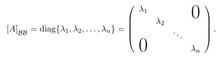
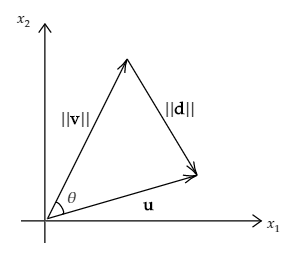

# Nociones de Algebra

## Nicolás Harari

    <a href="https://ndharari.github.io/MateUTDT/">Página principal</a>   
    Linear Algebra Done Wrong - Treil (2017)  

$$
% --Basic Stuff
% Encloses the argument using stretchable parentheses
\newcommand{\pa}[1]{\left( #1 \right) } 
% Encloses the argument using strechable brackets
\newcommand{\br}[1]{\left[ #1 \right] }
% Encloses the argument using strechable curly brackets
\newcommand{\llave}[1]{\left\{#1\right\}}
% leftrightarrow shortcut
\newcommand{\LRA}{\leftrightarrow}
% leftrightarrow shortcut
\newcommand{\RA}{\rightarrow}

% -- Sets and Letters
% Real Numbers
\newcommand{\R}{\mathbb{R}}
% Esperanza
\newcommand{\E}{\mathbb{E}}
% Lagrangeano
\newcommand{\Lagr}{\mathscr{L}}
% Sets
\newcommand{\set}[1]{\mathbb{#1}}

% --Calculus
% Arma una derivada parcial
\newcommand{\pd}[2]{\frac{\partial#1}{\partial#2}}
% Valued on
\newcommand{\von}[1]{\Big|_{#1}}

% -- Algebra
% Bold Letters for vectors
\newcommand{\vv}[1]{\mathbf{#1}}
% Define un sucesión dada una variable y n
\newcommand{\asuc}[2]{#1_1,#1_2,\ldots,#1_{#2}}
% Define un vector horizontal
\newcommand{\hvec}[1]{\langle #1 \rangle}
% Define una matriz grande y chica
\newcommand{\bmat}[1]{\begin{pmatrix}#1\end{pmatrix}}
\newcommand{\smat}[1]{\big(\begin{smallmatrix}#1\end{smallmatrix}\big)}
% Mismo pero para determinantes
\newcommand{\mydet}[1]{\begin{vmatrix}#1\end{vmatrix}}
% Some Operators:
\newcommand{\Ker}{\operatorname{Ker}}
\newcommand{\Img}{\operatorname{Img}}
\newcommand{\Ran}{\operatorname{Ran}}
$$

[TOC]

---

### Espacios vectoriales y conjuntos generadores:

###### <u>Definición:</u> Espacio Vectorial

> Se obtiene un **espacio vectorial** $V$ de un conjunto no vacío (cuyos elementos son los *vectores*), una *operación interna* (*suma*) y una *operación externa* (*producto escalar*) definida respecto a un cuerpo $\set{F}$ que cumplen con $\forall \lambda \in \set{F}, \vv{v}\in V$  está definido $\lambda \vv{v}\in V$ y cumple las siguientes propiedades:
>
> |                        Conmutatividad                        |                        Asociatividad                         |                     Cero                      |                       Inversa aditiva                        |
> | :----------------------------------------------------------: | :----------------------------------------------------------: | :-------------------------------------------: | :----------------------------------------------------------: |
> | $\vv{v}+\vv{w}=\vv{w}+\vv{v} \ \  \forall\vv{v},\vv{w}\in V$ | $(\vv{u}+\vv{v})+\vv{w}=\vv{u}+(\vv{v}+\vv{w}) \ \ \forall\vv{u},\vv{v},\vv{w}\in V$ | $\vv{v}+\vv{0}=\vv{v} \ \ \forall\vv{v}\in V$ | $\forall \vv{v} \in V \ \  \exists \vv{w} \in V :\vv{v}+\vv{w}=0$ |
>
> |         Identidad multiplicativa         |                 Asociatividad multiplicativa                 |                  Distributiva 1                   |                 Distributiva 2                  |
> | :--------------------------------------: | :----------------------------------------------------------: | :-----------------------------------------------: | :---------------------------------------------: |
> | $1\vv{v}=\vv{v} \ \  \forall\vv{v}\in V$ | $(\alpha\beta)\vv{v}=\alpha(\beta\vv{v}) \ \ \forall  \alpha, \beta \in \set{F}, \vv{v} \in V$ | $\alpha(\vv{u}+\vv{v})=\alpha\vv{u}+\alpha\vv{v}$ | $(\alpha+\beta)\vv{v}=\alpha\vv{v}+\beta\vv{v}$ |
>
> Un mismo conjunto puede constituir un espacio vectorial con distintos campos $\set{F}$ . Por ejemplo, si los escalares son números reales se habla de un **espacio vectorial real**. Si en cambio son complejos, se habla de un espacio vectorial complejo.
>
> **Notar:** Necesitamos que $\set{F}$ sea un cuerpo para que siempre se pueda dividir (sin resto) por un escalar no negativo. De esta forma se pueden construir espacios vectoriales sobe $\set{Q}$ pero no sobre $\set{Z}$. 

###### <u>Definición:</u> Sub-Espacio

> Un **subespacio** de un espacio vectorial $V$ es un subconjunto no nulo $V_0\subset V$ que es cerrado sobre la suma vectorial y la multiplicación por escalar. En conjunto: $\alpha\vv{u}+\beta\vv{v}\in V$.  El vector nulo $\vv{0}$ pertenece a todo espacio vectorial.

<u>Notar:</u> como $V_0$ es un subconjunto de $V$, este también es un espacio vectorial. 

###### <u>Definiciones:</u> Combinaciones lineales, generadores, independencia lineal y  bases

> Sea $V$ un espacio vectorial y $\asuc{\vv{v}}{p}\in V$ una colección de vectores:

- Una **combinación lineal** es una suma de forma que $\alpha_1\vv{v_1}+\alpha_2\vv{v_2}+ \dots + \alpha_p\vv{v_p}= \sum_{k=1}^p a_k \vv{v}_k$
- Un sistema de vectores $\asuc{\vv{v}}{p}\in V$ se llama **generador** de $V$ si cualquier vector $\vv{u}\in V$ admite una representación lineal  $\sum_{k=1}^p a_k \vv{v}_k= \vv{u}$.
- Una sistema de vectores $\asuc{\vv{v}}{n}\in V$ es **linealmente independiente** si y sólo si la única solución para $\sum_{k=1}^p a_k \vv{v}_k= \vv{0}$ es con $\forall i \ \alpha_i=0$
- Una sistema de vectores $\asuc{\vv{v}}{n}\in V$ es una **base** del espacio si cualquier vector $\vv{u}\in V$ tiene una **única** representación lineal.  De esta forma, la ecuación $\sum_{k=1}^n a_k \vv{v}_k= \vv{u}$ tiene solución **única** en $\alpha_i$.  Notar que toda base es un conjunto de vectores generadores linealmente independientes. Se llama **dimensión** al número $n$ de vectores en una base.

### Transformaciones lineales:

###### <u>Definición:</u> Transformación Lineal

> Una **transformación** (o función) $T:D\to E$ se llama **lineal** si cumple que $T(\alpha\vv{u}+\beta\vv{v})=\alpha T(\vv{u})+\beta T(\vv{v})$ para todo vector en el dominio $D$ y todo escalar en el campo. Se llama a  $E$ el *codominio* de la transformación.

**Notar:** toda transformación lineal $T:\set{F}^n\to\set{F}^m$ puede representarse como una **multiplicación matricial respecto a la base**.  Para obtener esta matriz se necesita juntar los vectores $\vv{a}_k=T\vv{e}_k$ donde $\asuc{\vv{e}}{n}$ es la base canónica de $\set{F^n}$ y se obtiene una matriz de $m\times n$:
$$
\left(\begin{array}{cccc}
a_{1,1} & a_{1,2} & \ldots & a_{1, n} \\
a_{2,1} & a_{2,2} & \ldots & a_{2, n} \\
\vdots & \vdots & & \vdots \\
a_{m, 1} & a_{m, 2} & \ldots & a_{m, n}
\end{array}\right)
$$
> **Otra lectura:** Como una matriz es una representación de una transformación lineal, al multiplicar por esta se está **aplicando la transformación**. 

Entonces, ¿qué implica multiplicar matrices? Bueno, **componer transformaciones lineales.** Dada las transformación lineales $g:\set{F}^m\to\set{F}^p$ y $h:\set{F}^n\to\set{F}^m$ resultante de la composición $p\equiv g\circ h:\set{F}^n\to\set{F}^p$ se puede expresar desde sus matrices asociadas como:
$$
GH=\underbrace{\bmat{\vdots \\ g_{i,1} \quad g_{i,2}\quad \cdots g_{i,n}\\ \vdots } }_{p\times m}
\underbrace{\bmat{h_{1,j} \\ \dots \quad h_{2,j} \quad  \dots \\ \vdots \\h_{m,j}}}_{m\times n} = 
\underbrace{\bmat{\vdots \\ \dots \quad p_{i,j} \quad \dots \\ \vdots}}_{p\times n}
$$
donde $p_{i_j}= g_{i, 1} h_{1, j}+g_{i, 2} h_{2, j}+\cdots+g_{i, n} h_{m, j}$ tiene las filas (codominio) de $G$ combinadas con las columnas (dominio) de $H$.

###### <u>Definición:</u> invertible

> Una matriz es ***invertible*** si y sólo si la transformación lineal asociada lo es. De esta forma $A:X\to Y$ es invertible si para cualquier $\vv{b}\in Y$ la ecuación $A\vv{x}= \vv{b}$ tiene solución única en $\vv{x}\in X$.
>
> <u>Corolario:</u> Una matriz $m\times n$ es invertible $\Leftrightarrow$ sus columnas forman una **base** en $\set{F}^m$.  De esta forma, $m=n$

Las transformaciones lineales pueden ser clasificadas de forma similar a otro tipo de funciones, utilizando los siguientes conceptos:

#### Espacio columna, núcleo y rango de una transformación lineal.

Sea $A:V\to W$ una transformación lineal, se definen sus subespacios asociados:

1. El espacio nulo o ***núcleo*** de $A$ ($\Ker  A$) como todos los vectores $\vv{v}\in V :A\vv{v}=0$

2. La **imagen** ($\Img  A$) es el conjunto de todos los vectores $\vv{w}\in W$ que pueden ser representados como $\vv{w}=A\vv{v}$ para algún vector $\vv{v}\in V$. Notar que cualquier tal vector puede ser representado como una combinación lineal de las columnas de la matriz $A$ por lo que también se lo conoce como un **espacio columna**

3. El **rango** de una transformación lineal es la dimensión de su imagen $\Ran :=\dim \Img A$. A su vez, $\Ran A=\Ran A^{T}$ por lo que el **rango columna es igual al rango fila**.

   >***<u>Teorema:</u>*** Sea $A:\set{F}^n\to\set{F}^m$ una transformación lineal y $A$ la matriz $m\times n$ asociada:
   >
   >1. $\dim \Ker A + \dim \Img A =\dim \Ker A + \Ran A= n$ la dimensión del dominio de $A$
   >2. $\dim \Ker A^T + \dim \Img A^T =\dim \Ker A^T + \Ran A= m $ la dimensión de la imagen de $A$
   >
   >Esto significa, en ambos casos, que la suma de las dimensiones del núcleo y del espacio columna son el número de columnas. Esto es especialmente evidente cuando $\Ker A = \vv{0}$, cuya dimensión es cero y donde el espacio columna es el número de columnas. Más adelante se explicitará que este es el caso en sistemas **linealmente independientes**.

#### Clasificación de Transformaciones Lineales

Como cualquier tipo de función, las transformaciones lineales  $T:\set{F}^n\to\set{F}^m$ pueden ser clasificadas respecto de la relación entre el conjunto, el codominio y la imagen. 

###### <u>Definición:</u>  monomorfismos, epimorfismos e isomorfismo.

> - $T$ es un **monomorfismo** (inyectiva) si no hay dos elementos del dominio con la misma imagen.  Por el teorema de la dimensión, esto es equivalente a plantear que $\Ker T = \vv{0}$. 
>   $$
>   \Ker T = 0 \iff \Ran T = n
>   $$
>   
> - $T$  es un **epimorfismo** (sobreyectiva) cuando la imagen y el codominio coinciden.  
>   $$
>   \Img T = \set{F^m}
>   $$
>
> - $T$ es entonces un **isomorfismo** (biyectiva) cuando se cumplen los dos casos anteriores.  De ser así, dice que  $T:V\to W$  es una función **uno-a-uno** existiendo su inversa  $T^{-1}:W\to V$ . 
>
>   Si  existe una transformación lineal isomorfa entre dos espacios lineales $V$ y $W$ se dice que estos son isomorfos y que ambos son distintas representaciones del mismo espacio y cualidades como "independencia lineal" o "bases" se mantienen en ellas.

<u>**Propiedad:**</u> Sea $T:V\to W$ una transformación lineal entre dos espacios vectoriales que cumplen $\dim V=\dim W= n$, si $T$  es un epimorfismo es también un monomorfismo y por ende, un isomorfismo.

### Soluciones de Sistemas de Ecuaciones:

Suponga un sistema de ecuación genérico $A\vv{x}=\vv{b}$. Si $\vv{b}=\vv{0}$ entonces el sistema es **homogéneo**, de lo contrario se lo llama **particular**.

> ###### <u>Teorema:</u> Toda solución de un sistema de ecuaciones se puede descomponer en sus partes homogéneas y particulares
>
> Sean $\vv{x}_p$ el vector que resuelve $A\vv{x}_p=\vv{b}$ y $\vv{x}_h$ que lo hace para $A\vv{x}=\vv{0}$. Suponga el vector $\vv{x}=\vv{x}_p+\vv{x}_h$. Si se multiplica por derecha a ambos lados de la igualdad por $A$ se obtiene:
> $$
> A\vv{x}=A(\vv{x}_p+\vv{x}_h)=A\vv{x}_p+A\vv{x}_h=\vv{b}+\vv{0}
> $$
> De forma que $\vv{x}$ es solución general del sistema.

Retomando los conceptos de núcleo ($\text{Ker }A := \{ \vv{v}\in V:A\vv{v}=\vv{0}\}$ e imagen ($\Img A := \{ \vv{w}\in W:\vv{w}=A\vv{v}\text{ para algún } \vv{v} \in V\}$) es posible afirmar que:

- El **núcleo** de una transformación lineal es el conjunto de soluciones homogéneas del sistema. De esta forma, podemos decir que una transformación es **linealmente independiente** si $\text{Ker } A = \vv{0}$
- La **imágen** de una transformación lineal es el conjunto de vectores $\vv{b}\in W$ que son solución al problema particular. De esta forma existirá solución si $\vv{b}$ se puede expresar como combinación lineal de las columnas de $A$.

###### <u>Teorema:</u> Roché-Frobenius

> Dado el sistema $A\vv{x}=\vv{b}$, este tendrá solución si el rango de la matriz ampliada $(A|b)$ es igual al rango de A. En otras palabras, el sistema tendrá solución si $\vv{b}$ es una combinación lineal de las columnas de $A$, algo ya mencionado anteriormente.

### Determinantes

Un determinante es una **función lineal** sobre un conjunto $\asuc{v}{n}\in\R^n$ que representa una noción del **volumen $n$-dimensional** del paralelepípedo determinado por los vectores. Se puede denotar $D(\asuc{v}{n})$ o bien si unimos los vectores para formar la matriz $A$  (que debe ser **cuadrada**), $\det A$

##### Propiedades:

- **Lineal en sus columnas:** $D(\vv{v}_1 \dots, \underbrace{\alpha\vv{u}_k+\beta\vv{v}_k}_k, \dots, \vv{v}_n)=\alpha D(\vv{v}_1 \dots, \vv{u}_k, \dots, \vv{v}_n) + \beta D(\vv{v}_1 \dots, \vv{v}_k, \dots, \vv{v}_n)$
- **Antisimétrico:** Si se intercambian las columnas el determinante cambia de signo
- **Normalización:** $\det I=1$

Se puede demostrar (buscar en el libro) que estas propiedades implican que $\det A=0\Leftrightarrow A$ **no es invertible** (por lo que sus columnas son linealmente dependientes.) Además, como $\det{A}=\det A^{-1}$ esto mismo aplica a las filas. 

### Eigenvalues and eigenvectors

Consideraremos transformaciones lineales $A:V\to V$ operando de un espacio vectorial a sí mismo, lo que puede representar como matrices $n\times n$. En este contexto definimos:

###### <u>Definición:</u> Autovalores y Autovectores

> Un escalar $\lambda$ es un **autovector** de un operador lineal $A:V\to V$ si existe $\vv{v}\in V$ no nulo para el que 
> $$
> A\vv{v}=\lambda\vv{v}
> $$
> donde $\vv{v}$ es el **autovector** correspondiente y encontrarlo es equivalente a resolver $(A-\lambda I)\vv{v}=\vv{0}$.

Ahora bien, como $A$ es una matriz **cuadrada** $(A-\lambda I)\vv{v}=\vv{0}\iff $para que valores de $\lambda$ la matriz $A$ es no invertible $\iff \det(A-\lambda I)=0$ cuyo resultado es un polinomio de grado $n$ en $\lambda$: el *polinomio característico de* $A$. 

Notar que los autovalores y autovectores están asociados a la transformación lineal y no a su representación específica como matrices. Por esto, distinta elección de base no altera sus resultados. La demostración está en el libro.

##### Propiedades:

1. Sea $A$ una matriz $n\times n$ y $\asuc{\lambda}{n}$ **todos** sus autovalores (distintos o iguales). Entonces:
   - $\operatorname{traza} A = \lambda_1+\lambda_2+\dots+\lambda_n$
   - $\det A = \lambda_1\lambda_2\dots\lambda_n$
2. Los autovalores de una matriz triangular (y por lo tanto, también diagonal) son sus entradas diagonales $a_{1,1},a_{2,2}, \dots , a_{n,n} $. La demostración es trivial y resulta de que en una matriz diagonal $\det(A-\lambda I)=(a_{1,1}-\lambda), \dots , (a_{n,n}-\lambda)$

#### Diagonalización de matrices:

Para algunas transformaciones lineales $A:\set{F}^n\to\set{F}^n$ existe la representación diagonal y roma la forma de $A=SDS^{-1}$ donde $D$ es una matriz diagonal y $S$ es invertible.

Dado $A$, si uno arma el espacio con base $\mathcal{B}=\asuc{\vv{b}}{n}$ autovectores y $\asuc{\lambda}{n}$ autovalores de la transformación, la matrix que representa a $A$ en esta base toma la forma:

> ###### <u>Teorema:</u> Descomposición Espectral
>
> Una matriz $A$ (en $\set{F}^n$) tiene una representación $A = SDS^{−1}$, donde $D$ es una matriz diagonal conformada por los autovalores y $S$ invertible matriz con los correspondientes autovectores $\LRA$ existe una base en $\set{F}^n$ de autovectores de $A$

Esto se vuelve especialmente útil si se considera que si $A=SDS^-1$ entonces:
$$
A^{N}=\underbrace{\left(S D S^{-1}\right)\left(S D S^{-1}\right) \ldots\left(S D S^{-1}\right)}_{N \text { veces }}=S D^{N} S^{-1}
$$
y calcular la aplicación repetida de determinadas transformaciones se vuelve crecientemente sencillo.

###### Condiciones para la diagonalización:

> - Para que una matriz sea diagonalizable, sus **autovectores deben ser linealmente independientes.**
> - Si un operador $A:V\to V$ tiene exactamente $n=\dim V$ *distintos* autovalores, entonces es diagonalizable

### Productos interiores y espacios normados

El contenido de este apartado se reduce a espacios vectoriales reales, de forma que $\lambda\in\set{F}=\R^n$.

> ###### <u>Definición:</u> Norma Euclideana
>
> Se define la **norma** de un vector $\vv{x}\in\R^n$ como $||\vv{x}||=\sqrt{x_1^2+x_2^2+\dots+x_n^2}$ . Este concepto no es más que la **distancia** desde la punta de un vector al origen. Como no es más que la generalización del resultado del **teorema de pitágoras** a un espacio $n$-dimensional también se la conoce como **distancia pitagórica**.

> ######  <u>Definición:</u> Producto interno (Dot Product)
>
> Dados dos vectores $\vv{v},\vv{u}\in \R^n$ se define su producto interno como $\vv{u}\cdot\vv{v}=u_1v_1 +\dots +u_nv_n= \sum_i^n u_iv_i$.  

De estas definiciones es posible demostrar que el producto interno de un vector con si mismo es igual al cuadrado de su norma: $\vv{v}\cdot \vv{v} = v_1v_1+\dots + v_nv_n=v_1^2+v_2^2=||\vv{v}||^2$. En $\R^2$ se puede ilustrar como:

|  |
| :----------------------------------------------------------: |
|             $\vv{v}\cdot \vv{v} = ||\vv{v}||^2$              |

El **producto interno** para cualquier elemento en $\R^n$ tiene las siguientes propiedades:

|               Simetría                |                          Linealidad                          |      No-Negatividad       |            No-Degeneratividad            |
| :-----------------------------------: | :----------------------------------------------------------: | :-----------------------: | :--------------------------------------: |
| $\vv{x}\cdot\vv{y}=\vv{y}\cdot\vv{x}$ | $(\alpha x+\beta \vv{y})\cdot \vv{z}=\alpha(\vv{x}\cdot\vv{z})+\beta(\vv{y} \cdot \vv{z})$ | $\vv{v}\cdot \vv{v}\geq0$ | $\vv{v}\cdot \vv{v}=0\iff \vv{v}=\vv{0}$ |

La siguiente propiedad relaciona ambos conceptos:

> #####  <u>Teorema:</u> Desigualdad de Cauchy–Schwarz
>
> $$
> |\vv{x}\cdot\vv{y}|\leq ||\vv{x}||\cdot||\vv{y}||
> $$
>
> **Demostración**: Consideremos el vector $\vv{u}=\vv{x}-t\vv{y}$ donde $t$ es un escalar positivo en $\R$.  Por la propiedad de no-negatividad sabemos que $\vv{u}\cdot\vv{u}=(\vv{x}-t\vv{y})\cdot (\vv{x}-t\vv{y})\geq 0$. Luego, por linealidad:
> $$
> (\vv{x}-t\vv{y})\cdot (\vv{x}-t\vv{y})\geq 0 \\
> \vv{x}\cdot\vv{x}-2t\vv{y}\cdot\vv{x}+t^2\vv{y}\cdot\vv{y}\geq 0
> $$
> Desde aquí, si alguno de los dos valores es igual a $\vv{0}$ la solución es trivial por no negatividad. Caso contrario, se puede analizar el enunciado de la izquierda como una función cuadrática en $t$. Como los productos internos son todos positivos la función tendrá mínimo en el vértice $t=\frac{\vv{x}\cdot\vv{y}}{\vv{y}\cdot\vv{y}}=\frac{\vv{x}\cdot\vv{y}}{||y||^2}$.  Reemplazando en la desigualdad anterior (y aplicando $\vv{v}\cdot \vv{v} = ||\vv{v}||^2$) se obtiene:
> $$
> ||\vv{x}||^2-2\frac{(\vv{x}\cdot\vv{y})^2}{||y||^2}+\frac{(\vv{x}\cdot\vv{y})^2}{||y||^4}||y||^2\geq 0 \\
> ||\vv{x}||^2-2\frac{(\vv{x}\cdot\vv{y})^2}{||y||^2}+\frac{(\vv{x}\cdot\vv{y})^2}{||y||^2}\geq 0 \\
> ||\vv{x}||^2+\frac{(\vv{x}\cdot\vv{y})^2}{||y||^2}\geq 0 \\
> ||\vv{x}||^2\cdot||y||^2\geq (\vv{x}\cdot\vv{y})^2\\
> |\vv{x}\cdot\vv{y}|\leq ||\vv{x}||\cdot||y|| \quad \blacksquare
> $$
> 

Un corolario inmediato de la **Desigualdad Cauchy–Schwarz** es la desigualdad del triángulo:

> ###### <u>Lema:</u> Desigualdad del Triángulo
>
> $$
> ||\vv{x}+\vv{y}||\leq ||\vv{x}||+||\vv{y}||
> $$
>
> **Demostración:** Partimos de $\|\vv{x}+\vv{y}\|^{2}=(\vv{x}+\vv{y})\cdot(\vv{x}+\vv{y})=\|\vv{x}\|^{2}+\|\vv{y}\|^{2}+2(\vv{x}\cdot\vv{y})$. Como es cierto que $2(\vv{x}\cdot\vv{y})\leq 2|(\vv{x}\cdot\vv{y})|$ podemos concluir que:
> $$
> \|\vv{x}+\vv{y}\|^{2}\leq\|\vv{x}\|^{2}+\|\vv{y}\|^{2}+2|(\vv{x}, \vv{y})| 
> $$
> Ahora bien, aplicando la **Desigualdad Cauchy–Schwarz** sabemos que $2|(\vv{x}, \vv{y})|\leq2\|\vv{x}\| \cdot\|\vv{y}\|$ y de esta forma
> $$
> \begin{align}
> \|\vv{x}+\vv{y}\|^{2}&\leq\|\vv{x}\|^{2}+\|\vv{y}\|^{2}+2\|\vv{x}\| \cdot\|\vv{y}\| \\
> |\vv{x}+\vv{y}\|^{2}&\leq(\|\vv{x}\|+\|\vv{y}\|)^{2} \qquad\blacksquare
> \end{align}
> $$
> 

##### Producto interno, ángulos y ortogonalidad.

> ###### <u>Definición:</u>  Ortogonalidad
>
> Dos vectores $\vv{u},\vv{v}$ son llamados *ortogonales* o *perpendiculares* si el producto interno entre ellos es nulo: $\vv{u}\cdot\vv{v}=0$ y se denota como $\vv{u}\perp\vv{v}$.

Ahora bien, ¿*qué tiene que ver el producto interno con ángulos*? Esbozamos una demostración en $\R^2$ considerando dos vectores $\vv{v},\vv{u}$ en este espacio de forma que el ángulo interno entre estos dos lo es $0<\theta<\frac{\pi}{2}$. Sea entonces  $\vv{d}=\vv{u}-\vv{v}$ el vector de *desplazamiento* (el cual une ambas puntas) desde $\vv{v}$ a $\vv{u}$ . De esta forma encontramos un triángulo $\triangle{\vv{v}\vv{d}\vv{u}}$ donde el largo de los lados son las normas de cada uno de los vectores.  

|  |
| :----------------------------------------------------------: |
|  Ilustración del triángulo $\triangle{\vv{v}\vv{d}\vv{u}}$   |

Aplicando la regla del coseno y la propiedad anterior se puede resolver por $\theta$:
$$
||\vv{u}-\vv{v}||^2 = ||\vv{u}||^2+||\vv{v}||^2 - 2||\vv{u}||||\vv{v}||\cos\theta \\
\hvec{\vv{u}-\vv{v}}\cdot \hvec{\vv{u}-\vv{v}} = \vv{u}\cdot\vv{u}+\vv{v}\cdot\vv{v} - 2||\vv{u}||||\vv{v}||\cos\theta \\
\vv{u}\cdot\vv{u}-2\vv{u}\cdot\vv{v}+\vv{v}\cdot\vv{v} = \vv{u}\cdot\vv{u}+\vv{v}\cdot\vv{v} - 2||\vv{u}||||\vv{v}||\cos\theta \\
\vv{u}\cdot\vv{v}= ||\vv{u}||||\vv{v}||\cos\theta \\
$$
De esta forma, si $\theta=\frac{\pi}{2}\LRA \cos \theta=0$ por lo que la definición de ortogonalidad es consistente con nuestros preconceptos de geometría.  Además, se puede aseverar que en el caso en el que los vectores sean unitarios ($||\vv{u}||||\vv{v}||=1$) el producto interno es una expresión del ángulo entre ellos: $\vv{u}\cdot\vv{v}= \cos\theta \qquad \blacksquare$

> **Nota:** Decimos que un vector $\vv{v}$ es ortogonal a un subespacio $E$ si $\vv{v}$ es ortogonal a todos los vectores $\vv{w}\in E$. 
>
> Ahora bien, si los vectores $\asuc{\vv{w}}{_p}$ son base de $E$ alcanza con mostrar que $\vv{v}\perp\vv{w}_k \ \ \forall k =1,2,\dots,p$ para que $\vv{v}\perp E$  

#### Espacios normados: nociones generales.

La *norma euclidiana* no es la única concepción de norma posible.  Si en un $\set{F}$-espacio vectorial $V\sube \set{F}^n$ existe una función $||\cdot||:\vv{v}\to ||\vv{v}||\in \set{F}$ que cumpla las siguientes propiedades decimos que es una **norma** de $V$:

|                Homogeneidad                 |            Desigualdad Triangular             |  No-negatividad   |        No-degeneratividad        |
| :-----------------------------------------: | :-------------------------------------------: | :---------------: | :------------------------------: |
| $\|\alpha\vv{v}\|= |\alpha|\cdot\|\vv{v}\|$ | $\|\vv{x}+\vv{y}\|\leq \|\vv{x}\|+\|\vv{y}\|$ | $\|\vv{v}\|\geq0$ | $\|\vv{v}\|=0\iff \vv{v}=\vv{0}$ |

Por ejemplo, dado $p\in [1,\infty^+)$ se puede definir en $\R^n$  la norma $||\cdot||_p$ como:
$$
\|\vv{x}\|_{p}=\left(\left|x_{1}\right|^{p}+\left|x_{2}\right|^{p}+\ldots+\left|x_{n}\right|^{p}\right)^{1 / p}=\left(\sum_{k=1}^{n}\left|x_{k}\right|^{p}\right)^{1 / p}
$$
Donde los casos $p=2$ son la norma euclidiana y $p=\infty$ es la norma del taxista.

