# Conceptos de Cálculo Multivariado

## Nicolás Harari

    <a href="https://ndharari.github.io/MateUTDT/">Página principal</a> 
    Calculus - Stewart (2008)  
    Vector Calculus - Marsden & Tromba (2011) 
    Tópicos de Matemática - Marco Spinelli (2020)

$$
% --Basic Stuff
% Encloses the argument using stretchable parentheses
\newcommand{\pa}[1]{\left( #1 \right) } 
% Encloses the argument using strechable brackets
\newcommand{\br}[1]{\left[ #1 \right] }
% Encloses the argument using strechable curly brackets
\newcommand{\llave}[1]{\left\{#1\right\}}
% leftrightarrow shortcut
\newcommand{\LRA}{\leftrightarrow}
% leftrightarrow shortcut
\newcommand{\RA}{\rightarrow}

% -- Sets and Letters
% Real Numbers
\newcommand{\R}{\mathbb{R}}
% Esperanza
\newcommand{\E}{\mathbb{E}}
% Lagrangeano
\newcommand{\Lagr}{\mathscr{L}}
% Sets
\newcommand{\set}[1]{\mathbb{#1}}

% --Calculus
% Arma una derivada parcial
\newcommand{\pd}[2]{\frac{\partial#1}{\partial#2}}
% Valued on
\newcommand{\von}[1]{\Big|_{#1}}

% -- Algebra
% Bold Letters for vectors
\newcommand{\vv}[1]{\mathbf{#1}}
% Define un sucesión dada una variable y n
\newcommand{\asuc}[2]{#1_1,#1_2,\ldots,#1_{#2}}
% Define un vector horizontal
\newcommand{\hvec}[1]{\langle #1 \rangle}
% Define una matriz grande y chica
\newcommand{\bmat}[1]{\begin{pmatrix}#1\end{pmatrix}}
\newcommand{\smat}[1]{\big(\begin{smallmatrix}#1\end{smallmatrix}\big)}
% Mismo pero para determinantes
\newcommand{\mydet}[1]{\begin{vmatrix}#1\end{vmatrix}}
% Some Operators:
\newcommand{\Ker}{\operatorname{Ker}}
\newcommand{\Img}{\operatorname{Img}}
\newcommand{\Ran}{\operatorname{Ran}}
$$

[TOC]

---

### Conceptos iniciales

#### Funciones

###### <u>Definición:</u> Función de $n$ variables o vectoriales

> Una función $f:D\to E$ de $n$ variables es una regla que asigna cada n-tupla de elementos $(x_1, ... x_n)$ en el conjunto $D$ a un único valor en $E$ denotado por $f(x_1, ... x_n)$. El conjunto $D$ representa el **dominio** de $f$, $E$ es su codominio y su **rango** es el conjunto de valores que toma $f$ de forma que $\{f(x_1, ... x_n)|(x_1, ... x_n)\in D\}$.
>

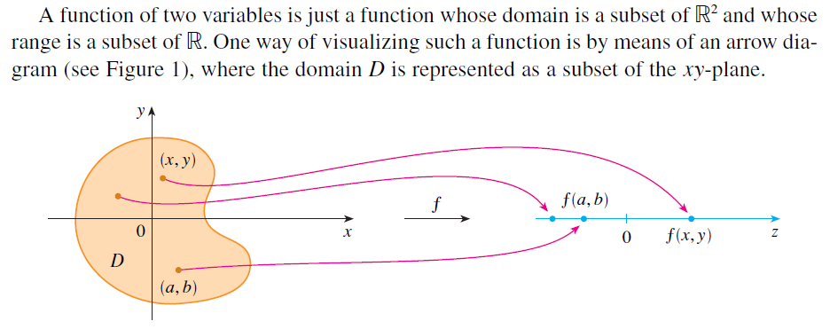

###### <u>Definición:</u> Gráfico

> Dada la función $f:D\to E$ su **gráfico** es el conjunto de todos los elementos $(a, b)$ tal que $a\in D$,  $b\in\{( f(a):a\in D\}$. De esta forma, si $D\times E$ es el producto cartesiano entre ambos conjuntos, el **gráfico** de $f$ es $G(f) =\{(a, f(a)):a\in D\} \sube \{D\times E\}$.
>
> - <u>Ejemplo:</u> Si $f:\R^2\to\R$ el **gráfico** de $f$ es el conjunto de todos los puntos $(x, y, z)$ en $\R^3$ tal que $z=f(x, y)$ y $(x, y)\in D$.
>

###### <u>Definición:</u> Conjuntos de nivel

> Dada una función $f:D\to E$ y un elemento en la imagen $c\in E$ el **conjunto de nivel** son todos los puntos de $x\in D$ para los cuales $f(x)=c$ de forma que: $\{x\in D: f(x)=c\}\sube D$

Este concepto se vuelve útil cuando los **gráficos** de las funciones son difíciles de graficar, especialmente si  $\dim G(f)>\R^2$. Por ejemplo, en el caso de una función $g: \R^2\to \R$ y un punto $k\in R$ en su rango las **curvas de nivel de $g$ en $k$** son todas las curvas con ecuación $f(x,y)=k$. 

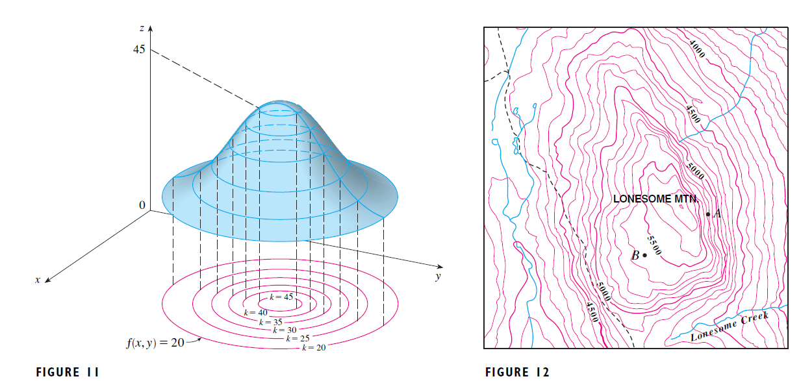

### Parametrizaciones, senderos y curvas.

Suponga que uno quiere describir el movimiento de un grano de arena (matemáticamente, un punto o la punta de un vector $\vv{v}$ centrado en el origen) que "*vuela*" a través de un espacio $n$-dimensional conforme avanza el tiempo. Si uno conoce la dinámica exacta de los vientos podría escribir una función que describa en cada momento del tiempo donde está respecto a cada uno de los "*ejes*". De esta forma, dado un momento $t$ del tiempo uno obtendría un $n-$par ordenado $(\asuc{x}{n})$. Este es el **sendero** del grano de arena.  Ahora bien, si uno pudiera seleccionar los puntos por los que pasó el grano de arena en el espacio, como si hubieran sido dibujados por un lápiz, obtendría una curva en $\R^n$. Matemáticamente:

###### <u>Definición:</u> Senderos y curvas

> Un **sendero** es una función  $c:\R\to\R^n$, mientras que llamamos **curva**  $C$ al conjunto de puntos de en la imagen de $c$ de forma que $\{\vv{x}\in \R^n|c(t)=\vv{x}\}$. Como se puede pensar a $t$ como un parámetro, decimos que $c$ **parametriza** a $C$ . 

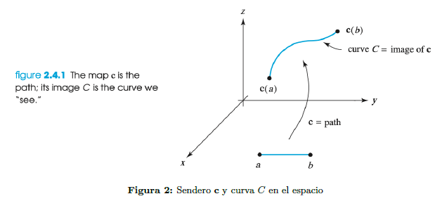

Algunos ejemplos: 

1. El círculo unitario $C: x^2 + y^2 = 1$ en el plano es la imagen del sendero $c:[0,2\pi]\subset\R\to\R^2| c(t)=\hvec{\cos t, \sin t}$ 
2. La línea recta que pasa por el punto $(x_0,y_0)$ es la imagen del sendero $c:\R\to\R^2| c(t)=\hvec{x_0+tv_1, y_0+tv_2}$

Como el segundo ejemplo muestra, es posible definir una recta desde un punto en el espacio y una dirección. Por lo que:

###### <u>Definición:</u> Parametrización de una recta por un punto

> La curva de una recta que pasa por el punto $\vv{a}$ en la dirección de $\vv{v}$ se puede parametrizar mediante el sendero:
> $$
> l:\R\to\R^n \text{ donde } l(t) = \vv{a}+t\vv{v} \qquad \text{Con $t\in \R$ y $\vv{a}, \vv{v}\in\R^n$}
> $$

El argumento es el siguiente: sea $\vv{a}$ un punto en el espacio. Si $t$ es una constante, sumar $\vv{a}+t\vv{v}$ implica desplazar el vector $\vv{tv}$ al punto $\vv{a}$. Si se deja libre a $t$ en $\R$ entonces el vector se ve *escalado* por toda las cantidades posibles y dibuja toda la recta. Esta caracterización no es única.

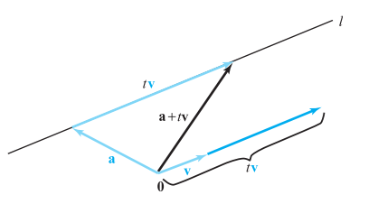

En el caso que se quiera obtener la ecuación de una recta que pasa por la punta de dos vectores $\vv{a}, \vv{b}$, el razonamiento es análogo. Buscamos el vector desplazamiento entre ellos $\vv{b}-\vv{a}$ el cual debemos "trasladar" hacia uno de los puntos (si no, estará en el origen). El resultado es:
> ###### <u>Definición:</u> Parametrización de una recta por dos puntos
> $$
> l(t)=\vv{a}+t(\vv{b}-\vv{a}) \LRA l(t)=(1-t)\vv{a}+t\vv{b}
> $$
>  Notar que la expresión $l(t)=t\vv{a}+(1-t)\vv{b}$ también representa la recta, dado que $t$ toma todo valor de $\R$.

#### Planos

Una pequeña digresión para definir planos, que resultan subespacios de $\R^3$ generados por dos vectores ortogonales. Dado cualquier punto $\vv{x_0}$ en él y un tercer vector $\vv{n}$ que sea *ortogonal* al plano (y por propiedad, a ambas bases) es posible expresar un plano como:

> ###### <u>Definición:</u> Ecuación de un plano en $\R^3$
>
> $$
> \vv{n}\cdot(\vv{x}-\vv{x}_0)=0 \LRA \vv{n}\cdot\vv{x}=\vv{n}\cdot\vv{x}_0 \\\text{ o bien en notación escalar:}\\
> n_1(x-x_0)+n_2(y-y_0)+n_3(z-z_0)=0
> $$
>
> Notar: si se despeja $z$ de la ecuación arriba presentada y tomando $z_0=f(x_0,y_0)$ entonces:
> $$
> z=f(x_0,y_0) +n_1(x-x_0)+n_2(y-y_0)
> $$
> 

---

### Limites y continuidad

Existen múltiples definiciones de límite; todas formas distintas de precisar la noción intuitiva de *cuando $\vv{x}$ se acerca a $\vv{x}_0$,  $f(x)$ se acerca  a $\vv{b}$*. A continuación se presentan dos posibles:

###### <u>Definición:</u> Límite

> Sea $f:A\sub \R^n \to \R^m$, $\vv{x}_0$ un punto en $A$ o en su frontera y $\vv{b}\in\R^m$ un elemento del codominio.  Existe el límite$_{\vv{x}\to \vv{x}{_0}} f(\vv{x})=\vv{b}$  si y solo sí para todo valor positivo de $\delta$ que satisface $0 <\|\vv{x}_0-\vv{x}\|<\delta$  existe un $\epsilon$ positivo tal que $\|f(\vv{x})-\vv{b}\|<\epsilon$.
>
> Equivalentemente se puede plantear los conjuntos demarcados por $\delta$ y $\epsilon$ como el entorno $N$ de $\vv{b}$ y $U$ de $\vv{x_0}$.  Decimos que $f$ está eventualmente en $N$ conforme $\vv{x}\to \vv{x}_0$ si existe un entorno $U$ de $\vv{x}_0$ en el que  $\vv{x}\neq\vv{x}_0, \vv{x}\in U$ y $\vv{x}\in A$ implica que $f(\vv{x})\in N$. Si estas condiciones se cumplen decimos que $f(\vv{x})$ tiende a $\vv{b}$ conforme $\vv{x}$ se acerca a $\vv{x}_0$ y se denota como $\lim_{\vv{x}\to\vv{x}_0}f(\vv{x})=\vv{b}$ 
>
> 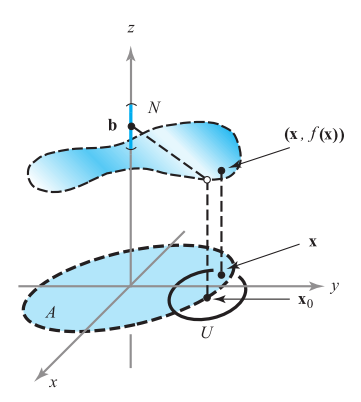

El límite de una función da una idea de que valores tendrá $f$ en un valor $\vv{x}_0$ según los resultados cercanos. Ahora bien, no tiene por qué ser que la $f$ tome el valor que su entorno aparenta (o puede ser que su entorno no de información) de esta forma definimos continuidad:

###### <u>Definición:</u> Continuidad

> Decimos que la función $f$ es continua en  $\vv{x}_0$ si existe el límite en  el punto y este cumple que:
> $$
> \lim_{\vv{x}\to\vv{x}_0}f(\vv{x})=f(\vv{x}_0)
> $$
> Y si se reemplaza en la línea anterior por la definición de límite obtenemos que $f$ es continua en $\vv{x}_0$ si y sólo si para toda distancia $\epsilon$ positiva existe un a distancia positiva $\delta$ tal que
> $$
> \text{$\vv{x}\in A$ y $\|\vv{x}-\vv{x}_0\|<\delta$ implica que $\|f(\vv{x})-f(\vv{x}_0)\|<\epsilon$ }
> $$
> La diferencia con la definición inicial de límite es que aquí no imponemos que $\vv{x}\neq\vv{x_0}$, sino lo contrario: necesitamos saber el valor *exactamente* cuando $\vv{x}=\vv{x}_0$: si este es similar al que "indicarían" los puntos conforme uno reduce $\delta$  en el dominio.

---

### Derivadas y diferencialidad

Suponga que se quiere encontrar el cociente incremental  de una función conforme uno se aproxima a un punto $\vv{x_o}$ en una dirección **arbitraria**. Para eso, definimos el concepto de **derivada direccional**:

> ###### <u>Definición:</u> Derivadas direccionales
>
> Sea $f:U\sub \R^n \to \R $ una función, $\vv{x}_0$ un punto del dominio y $\vv{v}\in \R^n$ un vector dirección. Para simplificar, asumiremos que $\|\vv{v}\|=1$.  En este caso, la derivada direccional en $f$ en el punto $\vv{x}_0$ en la dirección $\vv{v}$ es: 
> $$
> \pd{f}{\vv{v}}\von{\vv{x}_0}=\lim_{h\to0} \frac{f(\vv{x}_0+h\vv{v})-f(\vv{x}_0)}h
> $$

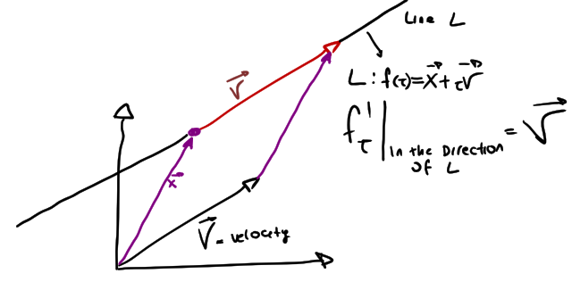

Ahora bien, por distintos motivos (en los que ahondaremos más adelante) es a veces conveniente "acercarnos" moviendo una variable a la vez. Es decir manteniendo todas las otras variables constantes, analizar el cociente si el incremento es en sólo una variable. 

###### <u>Definición:</u> Derivadas Parciales

>
>Sea $U\sub R^n$ un conjunto abierto y $f:U\sub \R^n \to \R $ una función en él. Definimos entonces a las derivadas parciales $\pd{f}{x_i}\von{\vv{x}_0}$ en el punto $\vv{x}_0$ como el límite del cociente incremental de $f$ cuando se incrementa infinitesimalmente en una sola en una dirección. Si $\vv{e}_j$ es el $j$-avo vector base ($\vv{e}_j=(0,\dots1, \dots0)$) entonces las derivadas parciales se pueden expresar como:
>$$
>\pd{f}{x_j}\von{\vv{x}_0}=\lim_{h\to0} \frac{f(\vv{x}_0+h\vv{e}_j)-f(\vv{x}_0)}{h}
>$$
>

Ahora bien, si se tiene una función $f:U\in R^n\to \R^m$, que asigna a cada vector $\vv{x}\in \R^n$ un **vector** $\vv{f}(\vv{x})\in \R^m$ en su imagen, ¿qué forma toman las derivadas parciales? En este caso de deberá derivar cada componente por separado como donde $\pd{f_j}{x_m}$ es la derivada parcial del $j-$avo componente respecto a la $i-$ava variable.

###### <u>Definición:</u> Matriz de Derivadas Parciales

> En el caso en el que **existan todas las derivadas parciales** de una función $f:U\in \R^n\to \R^m$ se puede formar la siguiente matriz:
> $$
> Df\von{\vv{x}}=\br{\pd{\vv{f}}{x_1}\dots\pd{\vv{f}}{x_n}}=
> \bmat{\pd{f_1}{x_1}\quad\dots\quad\pd{f_1}{x_n}\\ 
> 		\vdots\quad\ddots\quad\vdots\\
> 		\pd{f_m}{x_1}\quad\dots\quad\pd{f_m}{x_n}}
> $$
>
> que se conoce como la **matriz de derivadas parciales**, la **matriz jacobiana** o **derivada** (algunos autores usan diferencial) de la función. Cada columna representa una variable del $n$-dominio y cada fila un componente de la imagen $m$-dimensional. Más adelante se explicitará la conexión de las derivadas y las transformaciones lineales y se ahondará en el concepto de derivada total.
>

#### Gradientes

###### <u>Definición:</u> Vector gradiente

>
> En el caso especial donde $f:U\in\R^n\to\R$ la matriz de derivadas parciales $\vv{D}f(\vv{x})$ es una matriz de $1\times n:$
> $$
> \vv{D}f\von{\vv{x}_0}=\bmat{\pd{f}{x_1}\quad \dots \quad \pd{f}{n}}
> $$
> El vector correspondiente $(\pd{f}{x_1}, \dots, \pd{f}{x_n})^T$ se llama **gradiente** y se escribe $\nabla f$.

Este vector es útil, porque a partir de él es posible encontrar la derivada direccional en cualquier dirección:

###### <u>Teorema:</u>  Derivada direccional por gradiente

> Sea $f : \R^n \to \R$ una función diferenciable en $\vv{x}_0\in \R^n$, y $\vv{v}\in\R^n$ un vector dirección dado. La derivada direccional de $f$ en $ \vv{x}_0$ con dirección $\vv{v}$ es igual al producto interno de $\nabla f\von{\vv{x}_0}$ y  $\vv{v}$. 
>
> Adicionalmente, todas las derivadas direccionales existen en $\vv{x}_0$.

Resulta que el vector gradiente cumple con una propiedad muy especial. Si tomamos una función con gráfico en $\R^3$ podemos decir que es el gradiente es la dirección de mayor inclinación de la figura. Para explicitarlo en funciones más generales, utilizamos el concepto de **curvas de nivel**.

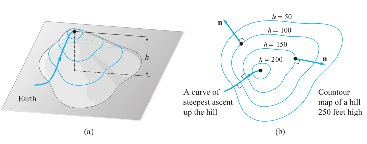

######  Teorema: Dirección de máximo crecimiento

> **El vector gradiente es perpendicular a las curvas de nivel**: Sea $f:\R^3\to \R$ una función $C^1$ (cuyas derivadas parciales existen y son continuas). Considere que $f(\mathbf{x_0})$ cae en la curva de nivel $S: f(\mathbf{x}) =k$, donde $k$ es una constante arbitraria.  Además tengo en $S$ un sendero $c(t)$ que valuado en $t=0$ se obtiene $c(0)=\mathbf{x_0}$. Sea a su vez $\mathbf{v}$ el vector tangente a $c(0)$. Este vector será **perpendicular** a $\nabla f(\mathbf{x_0})$, o lo que es equivalente: $\nabla f(\mathbf{x_0})\cdot \mathbf{v}=0$

###### Demostración:

- Si $c(t)$ está en $S \Rightarrow$ es posible meterlo en la curva de nivel $f(\mathbf{x})=k$, obteniendo $f(c_t)=k$.

- Si $k$ es una **constante** $\Rightarrow$ $f'_t (c_t)\von{t=0}=0$.
- Por **regla de la cadena**,  $f'_t (c_t)\von{t=0}= \nabla f(c_o)\cdot c'_t\von{t=0}=0$
- Como $\mathbf{v}$ es **tangente** a $c(0) \Rightarrow \mathbf{v}= c'_t\von{t=0}$ 

Reemplazando se obtiene $f'_t (c_t)\von{t=0}=\nabla f(c_o)\cdot \mathbf{v}=0$. Por propiedad del **producto interno** esto implica que el vector gradiente es perpendicular a la curva de nivel en el punto $\mathbf{x_o}$.

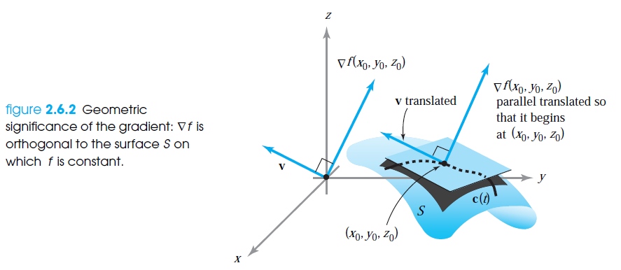

#### "Buenas" Aproximaciones Lineales

Imagine que tiene una función compleja y busca una aproximación lineal en el entorno de algún punto. Trabajando con funciones $f:\R^2\to \R$ lo que buscamos es la ecuación de un plano que "aproxime" la función en el punto. Dado un vector y el punto, sabemos que el plano tangente se encuentra en $\vv{n}\cdot(\vv{x}-\vv{x}_0)=0$ donde $\vv{n}$ es un vector normal al plano en el punto $\vv{x}_0$

Ahora bien, sabemos que el vector gradiente **es el perpendicular** a la función en el punto, por lo que la ecuación de la aproximación lineal toma la forma $\nabla f\cdot(\vv{x}-\vv{x}_0)=0$, que en forma de ecuación y recordando que $z_0=f(x_0,y_0)$ toma la forma:
$$
z=f(x_0,y_0)+\pd{f}{x}\von{x_0,y_0}(x-x_0)+\pd{f}{y}\von{x_0,y_0}(y-y_0)
$$
Que es la ecuación del plano tangente al gráfico de $f$ en $(x_0, y_0)$. Ahora bien, ¿es esta una *buena* aproximación? Para ver esto, se expone el caso de una sola variable, donde si existe la derivada de $f$ en $x_0$ entonces:
$$
\lim _{\Delta x \rightarrow 0} \frac{f\left(x_{0}+\Delta x\right)-f\left(x_{0}\right)}{\Delta x}=f^{\prime}\left(x_{0}\right)
$$
definiendo $x = x_0 + \Delta x$, se puede reescribir lo anterior como:
$$
\begin{array}{c}
\lim _{x \rightarrow x_{0}} \frac{f(x)-f\left(x_{0}\right)}{x-x_{0}}=f^{\prime}\left(x_{0}\right) \\
\lim _{x \rightarrow x_{0}} \frac{f(x)-f\left(x_{0}\right)}{x-x_{0}}-f^{\prime}\left(x_{0}\right)=0 \\
\lim _{x \rightarrow x_{0}} \frac{f(x)-f\left(x_{0}\right)-f^{\prime}\left(x_{0}\right)\left(x-x_{0}\right)}{x-x_{0}}=0
\end{array}
$$
Esta última expresión implica que la recta tangente que pasa por $(x_0; f(x_0))$ y posee una pendiente $f'\von{x_0}$ es cercana a $f$ en el sentido de que la diferencia entre ambas es $f(x_0) + f'\von{x_0}(x - x_0)$, que dividida por el incremento tiende a cero conforme este lo hace. Esta es la noción de *’buena’ aproximación* en la que se piensa para hablar de ***diferenciabilidad*** en funciones de más variables.

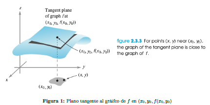

Antes definimos la ecuación de un plano tangente a un punto. También se puede definir la recta tangente a una curva de nivel.

###### Definición: Ecuación de la Recta Tangente a una Curva de Nivel

> Sea $f(x,y)=c$  una curva de nivel de $f$. La ecuación de la recta tangente al gráfico de la curva de nivel en $\vv{x}_0$ es:
> $$
> \nabla f \von{\vv{x}_0}\cdot (\vv{x}-\vv{x}_0)=0
> $$
> Donde $\vv{x}=\hvec{x,y}$. Esto implica que el vector gradiente de $f$ es ortogonal al vector $(\vv{x}-\vv{x}_0)$, dado que su producto interno es nulo. Naturalmente, esta afirmación es idéntica a afirmar que el vector gradiente es ortogonal a la recta tangente.

#### Aproximaciones Lineales a funciones de $\R^n$ a $\R^m$

Ahora bien, todo lo anterior es simple cuando se trata de funciones reales, donde los elementos de la imagen son valores reales. ¿Qué ocurre cuando $f:U\in \R^n\to \R^m$, sigue siendo una aproximación lineal en este caso? La respuesta a continuación se adapta de [aquí](https://math.stackexchange.com/questions/621949/understanding-the-derivative-as-a-linear-transformation).

> <u>**Notar:**</u> para toda función $f : \R^n \to^m \R$ la **derivada** es una transformación lineal $Df({\bf x})$y la matriz asociada es el jacobiano. En el caso específico que  $f : \mathbb{R} \to \mathbb{R}$ la derivada es un número, la pendiente de la recta tangente. ¿Cuál es la relación entre estos conceptos?

Bueno, en cálculo de *una variable* se enseña que la derivada de $f$  valuada en $x=a$ es el **número real** $\pd{f}{x}\von{a}$ o la **pendiente de la recta tangente** en $f(x=a)$. La ecuación de esta recta es $y = \pd{f}{x}\von{a}(x-a) + f(a)$. Recuerde: la recta tangente es la aproximación, **no la derivada**. Ahora bien, si hacemos un cambio de variables, de forma que $x^* = x - a$, $y^* = y - f(a)$, la recta tangente ahora resulta  $y^* = \pd{f}{x}\von{a}x^*$ y mostramos que la derivada es una (función) **transformación** lineal $\mathbb{R} \to \mathbb{R}$ y la matriz asociada es  $Df\von{a}=\br{\pd{f}{x}\von{x=a}}$.

Esto se mantiene en el caso más complejo con funciones $f : \mathbb{R}^n \to \mathbb{R}^m$ evaluadas en **vectores** ${\bf a} \in \mathbb{R}^n$: la derivada ahora es $Df\von{\vv{a}}$, la matriz de $m\times n$ de **derivadas parciales**. En este caso, la mejor aproximación lineal de $f$ en $\vv{a}$ resulta ${\bf y} = Df\von{a}({\bf x}-{\bf a}) + f({\bf a})$. Si volvemos a hacer el cambio de variables ${\bf x}^* = {\bf x} - {\bf a}$, ${\bf y}^* = {\bf y} - f({\bf a})$, la "*recta tangente*" se vuelve  ${\bf y}^* = Df({\bf a}){\bf x}^*$ por lo que se mantiene que **la derivada es una  transformación lineal** (en este caso, $\mathbb{R}^n \to \mathbb{R}^m$) y la matriz asociada a esta transformación es el jacobiano. En el caso de una sola variable teníamos sólo el  caso particular con  $m = n = 1$.

Este es el motivo por el cual no se usa un *número* para encontrar la mejor aproximación lineal para una función $\mathbb{R}^n \to \mathbb{R}^m$. Si es una aproximación lineal, debe compartir la forma de la función original:  ${\bf y} = A{\bf x} + {\bf b}$ donde $A$ es una matriz $m \times n$ y  ${\bf b} \in \mathbb{R}^m$. De esta forma, si mantenemos que la pendiente indicada debe ser la **derivada**, encontrar $Df$ para funciones que no son $\R\to\R$ es encontrar una matriz $m\times n$ , no un número como en cálculo univariado.

> "*That presentation, which throughout adheres strictly to our general "geometric" outlook on Analysis, aims at keeping as close as possible to the fundamental idea of Calculus, namely the "local" approximation of functions by linear functions. In the classical teaching of Calculus, **the idea is immediately obscured by the accidental fact that, on a one-dimensional vector space, there is a one-to-one correspondence between linear forms and numbers, and therefore the derivative at a point is defined as a number instead of a linear form.** This slavish subservience to the shibboleth of numerical interpretation at any cost becomes much worse when dealing with functions of several variables...*" Dieudonne in "Modern Analysis", Chapter VIII.

#### Diferenciabilidad 

Definimos anteriormente la idea de una *buena aproximación lineal* a una función. A continuación daremos unas condiciones para que esto ocurra. La existencia de una *buena aproximación lineal* en todo el recorrido de una función implicará que esta es *bien comportada*: no tenga *quiebres*, *dobleces*, *picos* o *puntos esquina* en su gráfico. Partiendo de la matriz de derivadas parciales podemos definir el concepto de **diferenciabilidad**:

###### <u>Definición:</u> Diferenciabilidad

>Sea $U$ un conjunto abierto en $\R^n$ y $f:U\sub \R^n\to\R^m$ una función definida en él. Se dice que $f$ es **diferenciable** en $\vv{x}_0\in U$ si existe $Df\von{\vv{x}_0}$ y si:
>$$
>\lim _{x \rightarrow x} \frac{\|f(\vv{x})-f(\vv{x}_0)-Df\von{\vv{x}_0} \cdot(\vv{x}-\vv{x}_0)\|}{\|(\vv{x}-\vv{x}_0)\|}
>$$
>En dos variables esta condición toma la forma:
>$$
>\lim _{(x, y) \rightarrow(x_{0}, y_{0})} 
>\frac{f(x, y)-f(x_{0}, y_{0})- \pd{f}{x}\von{x_{0}, y_{0}}(x-x_{0})-
>\pd{f}{y}\von{x_{0}, y_{0}}(y-y_{0})}
>{\|(x, y)-(x_{0}, y_{0})\|}=0
>$$
>Que es equivalente a pedir que el plano tangente encontrado anteriormente sea buena aproximación de $f$.

###### <u>Teorema:</u> Diferenciabilidad y Continuidad.

> Sea $f : U \sub R^n \to R^m$ diferenciable en $\vv{x}_0 \in U$. Entonces, $f$ es **continua** en $\vv{x}_0$.

Esto tiene sentido: recordar que diferenciabilidad implicaba que la función es *bien comportada* y existe un plano tangente en todos sus puntos. Para eso, debe ser continua. 

> **Notar**: el recíproco no es cierto, es decir, existen funciones continuas que no son diferenciables.

###### <u>Teorema</u>  Diferenciabilidad y Funciones $C^{1}$

> Sea $f: U \subset \mathbb{R}^{n} \mapsto \mathbb{R}^{m}$, donde se asume que existe $Df$ y todas las derivadas parciales son continuas todos sus puntos. Entonces, $f$ es diferenciable en $x$.
>
> Una función cuyas derivadas parciales existen y son continuas se dice que es de clase $C^{1}$, por lo cual, toda $f \in C^{1}$ es diferenciable.

----

### Dos teoremas importantes

#### Regla de la cadena

Una posibilidad sería preguntarnos como se puede aplicar la diferenciación a una composición de dos funciones. Esto puede parecer complejo, pero hay una respuesta simple si recordamos que el operador $D$ es una **transformación lineal**, de la que la matriz de derivadas es sólo una **representación**. Entonces, como se explicita en el apartado respecto a álgebra **la multiplicación de matrices no es más que la composición de transformaciones lineales** por lo que nuestra regla de la cadena se puede expresar como:

###### <u>Teorema:</u> Regla de la cadena

> Sean $g:U\sub\R^n\to\R^m$ y $f:V\sub\R^m\to\R^p$ dos funciones de forma tal que $g$ asigna $U\mapsto V$ y se encuentra definida la composición $f\circ g:\R^n\to\R^p$ está definida. Suponga también que $g$ es diferenciable en $\vv{x}_0$ y $f$ es diferenciable en $\vv{y}_0=g(\vv{x}_0)$. Entonces $f\circ g$ es diferenciable en $\vv{x}_0$ y
> $$
> D(f\circ g)\von{\vv{x}_0}=Df\von{\vv{y}_0}Dg\von{\vv{x}_0}
> $$

Nota: Recordar que si una función es $\R^n\to\R^m$, la matriz que la representa tiene $m$ filas y $n$ columnas.

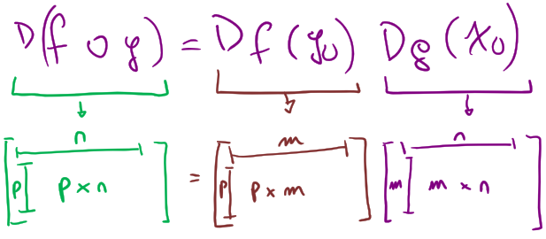

Un caso especial se puede encontrar con $\boldsymbol{x}(t)=\left(x_{1}(t), \ldots, x_{n}(t)\right)$ una función diferenciable en un intervalo alrededor de $t_{0}$ y $f$ una función diferenciable en una bola alrededor de $\boldsymbol{x}\left(t_{0}\right)$. Entonces, $g(t) \equiv(f \circ \boldsymbol{x})\von{t_{0}}$ es diferenciable en $t_{0}$ y, además,
$$
\frac{d g}{d t}\left(t_{0}\right)=\frac{\partial f}{x_{1}}\left(\boldsymbol{x}\left(t_{0}\right)\right) \cdot \frac{d x_{1}}{d t}\left(t_{0}\right)+\ldots+\frac{\partial f}{x_{n}}\left(\boldsymbol{x}\left(t_{0}\right)\right) \cdot \frac{d x_{n}}{d t}\left(t_{0}\right)
$$
Este resultado se utilizará más adelante.

#### Diferenciación implícita

Tomado enteramente de Marco Spinelli (2020)

En los casos tratados con anterioridad contamos con formas explícitas, sean generales o específicas, para cada una de las funciones. Sin embargo, bajo ciertas condiciones, una ecuación o una curva de nivel permite definir a una variable en función de las demás presentes en ella. Es decir, puede tenerse un caso donde

$$
G\pa{f(\vv{x}), \ \vv{x}}=c \quad \text{ con $f:U\sub R^n\to R$} 
$$

Es decir, en este caso genérico, $G(\cdot) = c$ aporta todos los vectores $k \in R^{n+1}$ cuya imagen es igual a $c$. Un ejemplo posible es el siguiente:
$$
x^2-3xy-y^3-7=0
$$
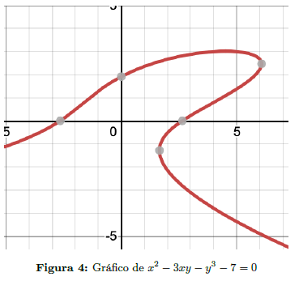

A partir del gráfico de esta curva de nivel, es posible observar que para ciertos valores de $x$ no es posible expresar $y$ como función de $x$ debido a que existe más de una imagen por valor de x. Lo mismo sucede en el caso contrario. 
Si se analiza detalladamente, es posible observar que solo existen algunos puntos cuyo inmediato entorno admite dos imágenes para un valor de $x$ o $y$ según sea el caso. Estos son los puntos donde $\pd{y}{x}=0$ o $\pd{x}{y}=0$ dado que en su entorno la función puede tomar dos valores de imagen. En cambio, para el resto de los puntos, aún sea en un entorno muy reducido, será posible expresar una variable en función de las restantes.

Yendo aún más lejos, incluso sin poder encontrar la expresión explícita de una variable en función de las otras, es posible encontrar la derivada de dicha variable con respecto a las demás. En efecto, esto es una aplicación de la regla de la cadena desarrollada anteriormente. Lo que se está realizando es restringir la función a una curva de nivel para encontrar la relación entre las variables que la componen.

###### <u>Teorema:</u> Función implícita

> Sea $F:\R^{n+1}\to\R$ una función clase $C^1$. Si consideramos que $\vv{x}\in \R^n$ y $z\in \R$, todo punto del dominio se puede expresar como $(\vv{x}, z)$. Si se asume que $(\vv{x}_0, z_0)$ satisface
> $$
> F(x_0,z_0)=k \quad \pd{F}{z}\von{(\vv{x}_0, z_0)}\neq 0
> $$
> entonces existe un entorno $U$ que contiene a $\vv{x}$ en $\R^n$ y un entorno $V$ que contiene a $z_0$ en $R$ donde existe una única función $z=g(x)$ clase $C^1$ definida para $\vv{x}\in U$ y $z\in V$ que satisface
> $$
> F(\vv{x}, g(\vv{x}))=k \text{ y además } \pd{z}{x_i}= -\frac{\partial F /\partial x_i}{\partial F/\partial z}
> $$
> O de forma equivalente: $Dg\von{\vv{x}}=-\frac{D_xF(\vv{x}, z)}{\pd{F}{z}}\von{z=g(\vv{x})}$
> 

#### Resumen de propiedades.

1. Si existe el gradiente (por ende, todas las derivadas parciales) de $f$ en $\vv{x}_0 \to$  todas las derivadas direccionales existen en $\vv{x}_0$
2. Si $f$ es diferenciable en $\vv{x}_0 \to f$ es continua en $\vv{x}_0$ (*La diferenciabilidad es más débil que la continuidad*).
3. Si $f$ es diferenciable en $\vv{x}_0 \to$  las derivadas parciales de $f$ en $\vv{x_0}$ existen (*por definición*)
4. Si todas las derivadas parciales de $f$ existen y son continuas en un punto $\to$ $f$ es diferenciable.
5. Derivadas parciales continuas $\overset4\implies$ Diferenciabilidad $\overset{1 \wedge 2}\implies$ $f$ es continua y existen derivadas en todas las direcciones.

##### CUIDADO:

- Una función puede ser continua en un punto **y no diferenciable**.
- Todas las derivadas direccionales pueden existir en funciones **discontinuas** en un punto.
- Todas las derivadas direccionales pueden existir en funciones **no diferenciables**.

---

### Optimización

Imaginemos que se nos propone encontrar el máximo valor que toma la función $f(\vv{x})$. Ahora bien, imagine que se le impone cierta condición, es decir, que los valores de $\vv{x}$ deben respetar $g(\vv{x})=c$. Aquellos valores que son entre los que respetan esta condición los llamaremos *conjunto factible*

De forma más estricta, el problema toma la siguiente forma. Dada una función $f(\vv{x})$ y la curva de nivel $g(\vv{x})=c$, encuentre los valores máximos y mínimos de $f$ que se encuentren dentro de la curva.

Comenzaremos presentando un teorema poderoso:

###### <u>Teorema de Wierstrass</u>

> Una función continua definida en un conjunto **cerrado y acotado** de $R^n$ alcanza un máximo y un mínimo en dicho conjunto

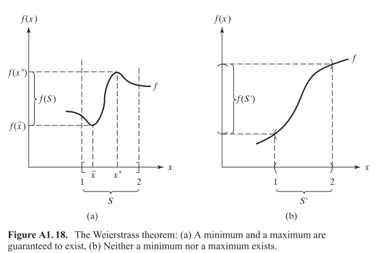

Este teorema es múy útil, porque nos indica que si la curva de nivel $g(\vv{x})=c$ a la que nuestro problema se circunscribe es un conjunto acotado, entonces existirán máximos y mínimos de la función. Ahora bien, puede ser que $g(\vv{x})=c$ no sea acotado y que existan máximos, mínimos o ambos. El teorema presenta condiciones de **suficiencia**. Al teorema de Wierstrass también se lo conoce como de valores extremos. Acompañado a él se encuentra:

###### <u>Teorema del Valor Intermedio</u>

> Sea $f$ una función continua definida en un intervalo$ I \sub R, [a; b]$. Entonces, para cada $u$ tal que $f(a) < u < f(b)$, existe al menos un $c$ dentro de $I$ tal que $f(c) = u$.
>
> Nota. El caso donde se define a $u = 0$ es el llamado **Teorema de Bolzano**

###### <u>Teorema de Fermat</u> 

> Si $x_0$ es un extremo local de una función $f$ y existe $f'\von{x_0}$, entonces $f'\von{x_0}=0$. El recíproco no se cumple.

Ahora podemos plantear el teorema central del problema de maximización:

#### Multiplicadores de Lagrange

###### <u>Teorema de Lagrange</u>

> Sean $f$ y $g$ funciones $C^1$ definidas en un abierto $U \in R^n$. Suponiendo que $x_o\in U$ es un extremo de $f$ sujeto a la restricción $C = \{x \in R^n : g(x) = c\}$ para un $c \in R$.  Si, adicionalmente, $x_0$ no es un punto crítico de $g$, i.e. $\nabla g\von{x_0} \neq 0$, entonces existe un $\lambda \in R$ tal que
> $$
> \nabla f\von{x_0}=\lambda \nabla g\von{x_0}
> $$
> 

Es importante notar que el Teorema de Lagrange requiere que los gradientes de $f$ y $g$ en el extremo sean paralelos, es decir, un múltiplo positivo del otro. De manera equivalente, las derivadas parciales de $f$ en $x_0$ deben ser proporcionales a las de $g$. Aquellos puntos donde se satisfaga la condición sobre estos gradientes son llamados puntos críticos.

***Observación***: En el caso donde la región factible $D$ sea definida por un número de restricciones, $g_i(\asuc{x}{n}) = c_i$, con $i = 1, \dots, m$, es posible generalizar el Teorema de Lagrange como:

>Si $f$ tiene un extremo en $x_0$ en $D$, entonces deben existir $m$ constantes $\asuc{\lambda}{m}$ tal que:
> $$
> \nabla f\von{x_0}=\lambda_1 \nabla g_1\von{x_0} + \dots + \lambda_m \nabla g_m\von{x_0}
> $$

**Observación**: No sólo es necesario obtener los valores para los que $\nabla f\von{x_0}=\lambda \nabla g\von{x_0}$. Además, es necesario realizar el proceso de **cualificación de restricciones**, es decir, asegurar que en los puntos críticos encontrados $\nabla g\von{x_0}\neq 0$. Además, es necesario considerar **como candidatos a extremo** los puntos que $\nabla g\von{x_0}\neq 0$

##### Nota: ¿Por qué pedimos que $\nabla g\von{x_0} \neq 0$?

En el teorema de la función implícita se pide que la derivada parcial de al menos una de las variables de la función sea distinta de cero para poder aplicar el teorema. En el teorema de Lagrange se exige que el gradiente de la restricción sea distinto de cero ¿Tienen estos conceptos alguna relación? Se recomienda leer la página $232$ del libro de Marsden y Tromba *Vector Calculus*  o [este link](https://www.maa.org/sites/default/files/nunemacher01010325718.pdf) para un desarrollo completo de la demostración. A continuación se presenta una intuición acotada.

Partimos de una curva de nivel $g(\vv{x})=c$  y un punto $\vv{x}_0$. Imagine que quiero encontrar una aproximación lineal a la curva de nivel en el entorno de mi punto. Llamemos a esa curva $c(t)$, un sendero tangente en el espacio del gráfico de mi curva de nivel. Para construirlo necesito el teorema de la función implícita, que me pide que para encontrar la derivada de $g(x,c(t))$ necesito que $\nabla g\neq0$. Gráficamente, si ese no fuera el caso, no se podría asegurar que los gradientes son paralelos entre sí.

| 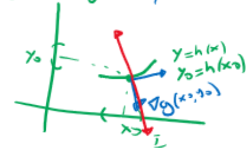 | 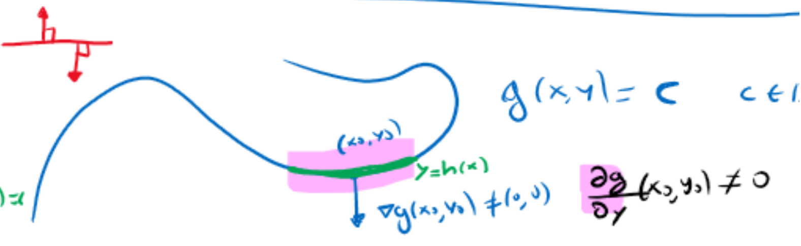 |
| :----------------------------------------------------------: | :----------------------------------------------------------: |
|  Si $\nabla g=0$ no ocurre que los gradientes son paralelos  | El sendero construido en el entorno de $\vv{x}_0$ en el contorno de la curva de nivel |

###### Otra explicación posible:

Recordemos que partimos del problema donde tenemos dos funciones $g$ y $f$, ambas $C^1$ **suaves** donde $g(\vv{x})=c$ es la curva de nivel de nuestra restricción.  Ahora bien, recordemos la siguiente definición:

> **Definición:** Sea $U$ una región abierta en $\R^n$ con frontera $\partial U$. Decimos que $\partial U$ es **suave** si es el conjunto de nivel de una función suave $g$ cuyo gradiente nunca es nulo $\nabla g \neq 0$.

Por lo que $\nabla g(\vv{x})\von{\vv{x}_0}\neq 0$, Teorema de la Función Implícita mediante, implica que el conjunto de nivel es *suave* en el entorno de $\vv{x}_0$. En este caso, es posible construir el sendero $c(t)$ que representa la frontera del conjunto de nivel en el entorno del punto. 

¿Que ocurriría si la frontera del conjunto de nivel no es *suave*? Bueno, entonces la curva de nivel no será *suave* en el entorno del punto y habrá puntos críticos que el método de Lagrange no podrá encontrar. A continuación se presenta un ejemplo al respecto.

| 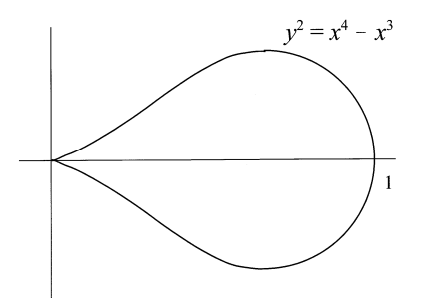 |
| :----------------------------------------------------------: |
| *El método de Lagrange no encontrará mínimo en la función con $f(x)=x$ porque* $\nabla g\von{\vv{x}=\vv{0}}=0$ |

La moraleja entonces es que la **geometría** importa y los multiplicadores de Lagrange pueden fallar en interpretar puntos candidatos si $\nabla g=0$. De esta forma, el procedimiento correcto para considerar todos los puntos que satisfacen  $\nabla f\von{x_0}=\lambda \nabla g\von{x_0}$ y a la vez los puntos críticos de $g$ (i.e, $\nabla g=0$).