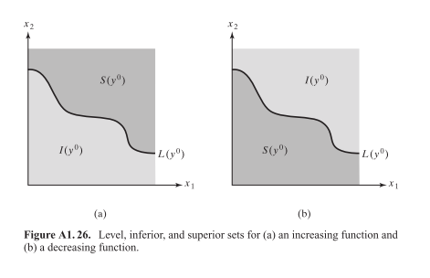
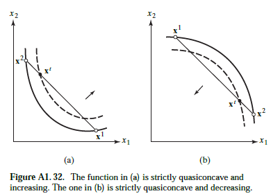
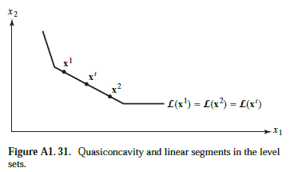

# Notas al Pie

## Nicolás Harari

    <a href="https://ndharari.github.io/MateUTDT/">Página principal</a> 
Apendix of Advanced Microeconomic Theory - Jehle & Reny (2011)

$$
% --General Stuff
% leftrightarrow shortcut
\newcommand{\LRA}{\leftrightarrow}
% leftrightarrow shortcut
\newcommand{\RA}{\rightarrow}
% Fraction shortcut
\newcommand{\f}[2]{\frac{#1}{#2}}
%QED
\newcommand\QED{\blacksquare}

% --Enclosing Stuff
% Encloses the argument using stretchable parentheses
\newcommand{\pa}[1]{\left( #1 \right) } 
% Encloses the argument using strechable brackets
\newcommand{\br}[1]{\left[ #1 \right] }
% Encloses the argument using strechable curly brackets
\newcommand{\llave}[1]{\left\{#1\right\}}
% Floor Func
\newcommand\floor[1]{\left\lfloor #1 \right\rfloor}
% Ceiling Func
\newcommand\ceil[1]{\left\lceil #1 \right\rceil}
% Absolute value
\newcommand\abs[1]{\left| #1 \right|}
% Norm
\newcommand\norm[1]{\left\| #1 \right\|}
% Create a set to be populated
\newcommand\conj[1]{\left\{ #1 \right\}}

% -- Sets and Letters
% Real Numbers
\newcommand{\R}{\mathbb{R}}
% Lagrangeano
\newcommand{\Lagr}{\mathscr{L}}
% Sets
\newcommand{\set}[1]{\mathbb{#1}}

% --Calculus
% Arma una derivada parcial
\newcommand{\pd}[2]{\frac{\partial#1}{\partial#2}}
% Valued on
\newcommand{\von}[1]{\Big|_{#1}}

% -- Algebra
% Bold Letters for vectors
\newcommand{\vv}[1]{\mathbf{#1}}
% Define un sucesión dada una variable y n
\newcommand{\asuc}[2]{#1_1,#1_2,\ldots,#1_{#2}}
% Define un vector horizontal
\newcommand{\hvec}[1]{\langle #1 \rangle}
% Define una matriz grande y chica
\newcommand{\bmat}[1]{\begin{pmatrix}#1\end{pmatrix}}
\newcommand{\smat}[1]{\big(\begin{smallmatrix}#1\end{smallmatrix}\big)}
% Mismo pero para determinantes
\newcommand{\mydet}[1]{\begin{vmatrix}#1\end{vmatrix}}

% -- Microeconomics
% Weak, strict preferences and indiference
\newcommand{\wpref}{\succsim}
\newcommand{\spref}{\succ}
\newcommand{\indif}{\sim}

% -- Probability
% Esperanza
\newcommand{\E}{\mathbb{E}}
% Varianza
\newcommand{\var}{\operatorname{var}}
\newcommand{\ssq}{\sigma^2}
% Correlation
\newcommand{\corr}{\operatorname{corr}}
% Covariance
\newcommand{\cov}{\operatorname{cov}}
$$

### Cuasiconcavidad

La **concavidad** de una función (estricta o no) es una restricción muy fuerte para imponer sobre una función. En algunos casos, sólo es necesaria una condición más débil, la *cuasicóncavidad*

> ###### <u>Definición:</u> Cuasiconcavidad
>
> $f:D\to R$ es una función cuasiconcava $\iff $ para toda combinación convexa $\vv{x}_t$ de dos puntos sobre del dominio $\vv{x}_1, \vv{x}_2 \in D$ se cumple que $f(\vv{x}_t)\geq \min\{f(\vv{x_1}), f(\vv{x_2})\}$ 
>
> Nota: una **combinación convexa** toma la forma $\alpha_1 \vv{x}_i+\ldots+\alpha_n\vv{x}_n$ donde toda $\alpha_i>0$ y $\sum_i^n\alpha_i=1$. Toda combinación convexa entre los dos puntos **cae en el segmento que los une.**

Ahora bien, esta descripción es un poco complicada de entender. Una forma más simple incluye las curvas de nivel de la función $f$. Para eso antes tenemos que definir ciertos conceptos:

##### Desvío:  conjunto de nivel, conjunto inferior y conjunto superior

Suponga una función $f:D\to R$ con $\vv{x_1}$ un punto dentro del dominio, el **conjunto de nivel** $L (\vv{x}_1)$ son todos los otros puntos dentro de D que comparten la misma imagen de forma que $L (\vv{x}_1)=\{\vv{x}|x\in D, f(\vv{x})=f(\vv{x}_1)\}$. Desde aquí se puede definir los siguientes conjuntos:

- El **conjunto superior** de una función relativo a un punto $\vv{x_1}$ dentro del dominio son todos los otros puntos  dentro de $D$ que tienen imagen igual o **mayor**: $S (\vv{x}_1)=\{\vv{x}|x\in D, f(\vv{x})\geq f(\vv{x}_1)\}$
- De manera opuesta, el **conjunto inferior** de una función relativo a un punto  $\vv{x_1}$ del dominio son todos los otros puntos  dentro de $D$ que tienen imagen igual o **menor**: $S (\vv{x}_1)=\{\vv{x}|x\in D, f(\vv{x})=f(\vv{x}_1)\}$

Análogamente, se puede construir los casos **estrictamente superiores** y **estrictamente inferiores**. A continuación se muestra los conjuntos de nivel, superiores e inferiores respecto a un valor $f(\vv{x}_t)=y^0$ en el caso donde $f$ es creciente y decreciente.

###### ¿Qué tiene que ver la cuasiconcavidad con las curvas de nivel?

Bueno, imaginemos que de una función *creciente* $f:D\to R$ tomamos dos puntos $\vv{x}_1, \vv{x}_2$ en su dominio, donde cada uno puede caer curvas de nivel *distintas*, $f(\vv{x}_1)\geq f(\vv{x}_2)$. Si la función es *cuasiconcava*, al formar una combinación convexa $\vv{x^t}$ (es decir, al cualquier punto en el **segmento** que los une) su curva de nivel $L(\vv{x}_t)$ está siempre sobre o por encima de la curva de la menor curva de nivel $L(\vv{x_1})$ o $L(\vv{x_2})$.

En otras palabras, es posible aseverar (la demostración se encuentra en el libro):

> ###### <u>Teorema:</u> Cuasiconcavidad y conjuntos superiores
>
> $f:D\to R$ es una función cuasiconcava $\iff $ $S(\vv{x})$ es convexo para todo punto $\vv{x}$ del dominio.
>
> O lo que es equivalente: cualquier segmento que une dos puntos de $S(\vv{x})$ se encuentra también dentro de él

Ahora bien, nada elimina la posibilidad que la curva de nivel tenga "segmentos lineales" de forma que el segmento que une $\vv{x}_1$ y  $\vv{x}_2$ *coincida* con el conjunto de nivel de forma que $f(\vv{x}_t)=f(\vv{x_1})= f(\vv{x_2})$. 

Ahora bien, de querer evitar esta condición se debe buscar que las funciones sean **estrictamente cuasicóncavas:**

> ###### <u>Definición:</u> Cuasiconcavidad estricta
>
> $f:D\to R$ es una función estrictamente cuasiconcava $\iff $ para toda combinación convexa $\vv{x}_t$ de dos puntos sobre del dominio $\vv{x}_1, \vv{x}_2 \in D$ se cumple que $f(\vv{x}_t)>\min\{f(\vv{x_1}), f(\vv{x_2})\}$ 
>
> La cuasiconacavidad estricta **excluye** segmentos lineales.

Ahora bien, como se dijo al principio la cuasiconcavidad es una característica **menos** estricta que la concavidad, de forma que:
$$
Concavidad \to Cuasiconcavidad  \to Cuasiconcavidad \ estricta
$$
Como resumen:
$$
\begin{align}
&f \text{ es cóncava }&\Longleftrightarrow& \text{ el conjunto de puntos por encima de la curva es cóncavo}\\
&f \text{ es convexa } &\Longleftrightarrow& \text{ el conjunto de puntos por encima de la curva es convexo}\\
&f \text{ cuasicóncava } &\Longleftrightarrow& \text{ el conjunto (de nivel) superior es convexo}\\
&f \text{ estrictamente cuasicóncava} &\Longleftrightarrow& \text{ el conjunto (de nivel) superior es convexo sin segmentos lineales}\\
\end{align}
$$

### Teorema de la Envolvente

Considere el siguiente problema de maximización:
$$
\max_{\vv{x}\in\R^n} f(\vv{x}, \vv{a}) \quad s.t \ \ g^j(\vv{x}, \vv{a})= 0 \quad j=1,\dots,m
$$
Y suponga que para este problema para cada parámetro $\vv{a}$ posible al  menos un $\vv{x}\in\R^n$ que es solución del problema. Si expresamos a nuestra variable en función de los parámetros $\vv{x}^*_{\vv{a}}$ y evaluamos en nuestra función objetivo obtenemos el valor de $f$ en el máximo expresado en  nuestros parámetros. Podemos definir entonces la ***función valor*** de la siguiente forma:
$$
V(\vv{a})\equiv f(\vv{x}^*_{\vv{a}}, \vv{a})= \max_{\vv{x}\in\R^n} f(\vv{x}, \vv{a}) \quad s.t \ \ g^j(\vv{x}, \vv{a})= 0 \quad j=1,\dots,m
$$
Supongamos ahora que cambia $\vv{a}$, hay dos formas que este puede afectar a $V$: el efecto directo del cambio de $\vv{a}$ y el efecto indirecto del cambio en $\vv{x}^*_{\vv{a}}$. Para encontrar este cambio, utilizamos el teorema de la envolvente:

> ###### Teorema de la Envolvente
>
> Sea $V(\vv{a})$ la función valor de un problema de maximización donde $f$ y $g^j$ son todas funciones $C^1$. De esta forma asuma que podemos construir el lagrangeano asociado$\Lagr(\vv{x}, \vv{a}, \vv{\lambda})$ que tiene al menos una solución $\vv{x}\in\R^n$, para cada parámetro $\vv{a}$ posible.  Entonces podemos afirmar que para todo $a_j$
> $$
> \pd{V(\vv{a})}{a_j}=\pd{\Lagr}{a_j}\von{\vv{x^*_a}, \vv{\lambda^*_a}} \quad j=1, \dots, m
> $$
> Por lo que el efecto de un cambio en la función valor respecto al parámetro $a_j$ es la derivada parcial de la función lagrangeana respecto a $a_j$ evaluada en el punto $(\vv{x^*_a}, \vv{\lambda^*_a})$

El teorema plantea que el **efecto total** en la función valor cuando cambia un parámetro se puede obtener simplemente tomando la derivada parcial respecto del parámetro y luego reemplazando en el resultado por la solución al problema de maximización. La demostración se encuentra en la página 604 del *Advanced Microeconomic Theory - Jehle & Reny (2011)*.