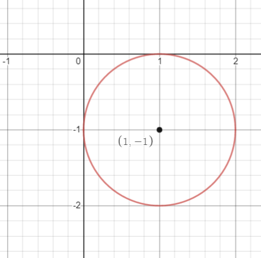

# Examen 1

    <a href="https://ndharari.github.io/MateUTDT/">Página principal</a>

$$
% --Basic Stuff
% Encloses the argument using stretchable parentheses
\newcommand{\pa}[1]{\left( #1 \right) } 
% Encloses the argument using strechable brackets
\newcommand{\br}[1]{\left[ #1 \right] }
% Encloses the argument using strechable curly brackets
\newcommand{\llave}[1]{\left\{#1\right\}}
% leftrightarrow shortcut
\newcommand{\LRA}{\leftrightarrow}
% leftrightarrow shortcut
\newcommand{\RA}{\rightarrow}

% -- Sets and Letters
% Real Numbers
\newcommand{\R}{\mathbb{R}}
% Esperanza
\newcommand{\E}{\mathbb{E}}
% Lagrangeano
\newcommand{\Lagr}{\mathscr{L}}
% Sets
\newcommand{\set}[1]{\mathbb{#1}}

% --Calculus
% Arma una derivada parcial
\newcommand{\pd}[2]{\frac{\partial#1}{\partial#2}}
\newcommand{\von}[1]{\Big|_{#1}}

% -- Algebra
% Bold Letters for vectors
\newcommand{\vv}[1]{\mathbf{#1}}
% Define un sucesión dada una variable y n
\newcommand{\asuc}[2]{#1_1,#1_2,\ldots,#1_{#2}}
% Define un vector horizontal
\newcommand{\hvec}[1]{\langle #1 \rangle}
% Define una matriz grande y chica
\newcommand{\bmat}[1]{\begin{pmatrix}#1\end{pmatrix}}
\newcommand{\smat}[1]{\big(\begin{smallmatrix}#1\end{smallmatrix}\big)}
% Mismo pero para determinantes
\newcommand{\mydet}[1]{\begin{vmatrix}#1\end{vmatrix}}
% Some Operators:
\newcommand{\Ker}{\operatorname{Ker}}
\newcommand{\Img}{\operatorname{Img}}
\newcommand{\Ran}{\operatorname{Ran}}
$$

#### Ejercicio 1. (30 puntos)

> Consideremos la función $f(x; y) = x^2 - 2x + 2y + y^2 + 4.$
>
> 1. Calcular la imagen de $f$.
> 2. Caracterizar las curvas de nivel de esta función.
> 3. Dar tres justificaciones diferentes de que el punto $(1;-1)$ es un mínimo.

1. $f$ puede ser re expresada de la siguiente forma: $f= (x-1)^2+(y+1)^2+2$ . Al ser una suma de elementos al cuadrado, sus componentes debe ser positivos. De forma que independiente del signo de $x$ e $y$, el valor de $f$ crece sin cuota superior. De esta forma el menor valor que pueden tomar los cuadrados es $0$, de forma que $f=2$ es el punto mínimo de la imagen. 
   $$
   \Img f =\{z\in  \R : z\geq2\}
   $$
   
2. Las curvas de nivel de la función, expresadas como $f(x,y)=(x-1)^2+(y+1)^2=c-2 $ representan circunferencias de radio $r= \sqrt{c-2}$ con $c\geq 2$

   

3. La primera justificación surge de la geometría de las curvas de nivel $f(x,y)=(x-1)^2+(y+1)^2+2=c $. De esta forma la circunferencia con menor radio se obtiene cuando $r=0\LRA\sqrt{c-2}=0 \LRA c=2$. Este resultado sólo se obtiene  en el punto $(1, -1)$ y es donde se obtiene el menor valor de la curva de nivel.

   La segunda justificación surge de los teoremas de extremos no condicionados. La condición necesaria mantiene que de existir un extremo este se encontrará en donde $\nabla f=0$. Como
   $$
   \nabla f : \matrix{2x-2\\2y+2}=0 \LRA \ \begin{align} x&=1 \\y&=-1\end{align}
   $$
   De forma que el punto mencionado $(1, -1)$ es un extremo de la función. Ahora bien, la condición suficiente de extremos plantea que este será un *mínimo* si la **matrix hessiana** de derivadas segundas es definida positiva. Así
   $$
   H= \matrix{2 & 0 \\ 0 & 2}
   $$
   como $|H|= 4>0$ y $2>0$ la matriz está definida positiva y la función es un mínimo. 

   **Tercera justificación**

   #### Ejercicio 2. 30 puntos

   > Sea $S \sub \R^3$ la superficie de nivel definida por los puntos $(x, y, z) \in \R^3$ tales que
   > $$
   > y^2z^3-x^2e^{2y-x}+12y=0
   > $$
   > 
   >
   > 1. Demostrar que en todos los puntos de la forma $(0; 0; z_0)$ con $z_0$ un número real arbitrario puede realizarse un despeje siguiendo el teorema de la función implícita. Indicar entonces cuáles son las variables libres, cuál la dependiente y calcular las derivadas parciales que correspondan.
   > 2. Encontrar los puntos $(x_0; y_0) \in \R^2$ para los cuales existe $z_0 \in \R$ tal que $(x_0; y_0; z_0)\in S$.
   > 3. En el ítem $1$, bajo las condiciones adecuadas, encontraron que una variable puede expresarse en función de las otras dos. Encontrar dos puntos concretos $p$ y $q$ de $S$ en los cuales se puedan obtener los dos despejes que no se hayan obtenido.

4. El teorema de la función implícita refiere a la superficie de nivel de una función  $C^1$  valuada en $\R$ y dado que $f(x, y, z)=y^2z^3-x^2e^{2y-x}+12y$ es una suma de funciones $C^1$, $f$ también lo es.  Además, para lograr realizar el despeje se necesita que exista al menos una variable $a$ para la cual $\pd{f}{a}$ valuada en el punto sea no nula. Considerando las derivadas parciales de $f$ valuadas en $(0; 0; z_0)$:
   $$
   \left\{\begin{align}
   &\pd{f}{x}|_{(0, 0, z_0)}= {(x - 2) x e^{2 y - x}}= 0 \\
   &\pd{f}{y}|_{(0, 0, z_0)}= {-2 x^2 e^{2y - x} + 2 y z^3 + 12}= 12\\
   &\pd{f}{z}|_{(0, 0, z_0)}= {3 y^2 z^2}= 0 
   \end{align}\right.
   $$
   Por lo que se cumplen las condiciones del teorema para al menos una variable en el punto. De esta forma, se puede asegurar que en un entorno del punto existe una función $y=g(x,z)$ donde $y$ es la variable dependiente, $x, z$ las libres y las derivadas parciales de $y(x,z)$ son:
   $$
   \left\{\begin{align}
   &\pd{y}{x}|_{(0; 0; z_0)}=\frac{(x - 2) x e^{2 y - x}}{{-2 x^2 e^{2y - x} + 2 y z^3 + 12}}=0\\
   &\pd{y}{z}|_{(0; 0; z_0)}=\frac{3 y^2 z^2}{{-2 x^2 e^{2y - x} + 2 y z^3 + 12}}=0
   \end{align}\right.
   $$

   2. Dado un punto $(x_0, y_0)$, entonces$f(x_0, y_0, z)=y_0^2z^3-x_0^2e^{2y_0-x_0}+12y_0=0$ resulta una ecuación cuadrática en $z^3$, asumiendo $y_0^2=a, \ x_0^2e^{2y_0-x_0}+12y_0=b$ se puede reducir en $az^3-b=0$. Esta expresión tiene una solución real única para siempre que $a\neq0\LRA y \neq0$ . Caso contrario, cualquier valor de $z$ será parte de la curva de nivel.

   3. En estos puntos debería ocurrir que $\pd{f}{x}, \pd{f}{z}\neq 0$. 
   
   - Como $e^{2 y - x}$ es siempre positivo, $\pd{f}{x}=0 \iff x=2 \ \or x=0$.
      - La expresión ${3 y^2 z^2}$ resulta cero solo cuando alguna variable del par $\{y, z\} $ lo sea.

      Por lo que se podrán encontrar los otros despejes en todo punto $(x_0, y_0, z_0)$ siempre que $x_0\neq 2 \wedge \ x_0\neq 0 \wedge y\neq 0 \wedge z\neq 0 $, siempre que el valor se encuentre en $S$. 
   
   Proponiendo valores arbitrarios de $x_0, y_0$ y reemplazando en $S(x_0, y_0, z)$ se obtienen los siguientes dos ejemplos: $p=(8; 4; 1)$ y $q=(4; 2; -\sqrt[3]2)$ los cuales se obtienen de proponer valores arbitrarios de $x_0;y_0$ y reemplaza

#### Ejercicio 3. 20 puntos

> Supongamos que $A$ es una matriz de $3 \times 3$ con entradas reales y que el sistema $A\vv{x} = \vv{0}$ tiene solución única. Consideremos además la matriz
> $$
> B= \bmat{1 &2&2\\-a&0&0\\5&3&4}
> $$
>
> 1. Calcular el rango de las matrices $AB$ y $BA$.
>
> 2. Demostrar que para cada $(a; b; c) \in \R^3$ el sistema
>    $$
>    (B^{-1})^2\bmat{x_1\\x_2\\x_3}=\bmat{a\\b\\c}
>    $$
>    tiene solución.

1. Para resolver este problema utilizaremos la noción de que una matriz puede interpretarse como  una transformación lineal, en este caso la matriz $A$ de $3\times 3$ sería la transformación $A: \R^3 \to \R^3$.

   Si $A\vv{x}=\vv{0}$ tiene solución única, ésta debe ser la trivial $\vv{x}=\vv{0}$. Esto implica que $\Ker A=\vv{0}$ y como $\dim D=\dim E = 3$ finito, podemos  asegurar que $A$ no sólo es un monomorfismo, sino también un **isomorfismo**. Además, sabemos que $B$ es una transformación lineal que cumple la misma propiedad, ya que las columnas de la matriz asociada son linealmente independientes.
   Considerando la multiplicación de matrices como una composición de transformaciones lineales obtenemos que dado $A: \R^3 \to \R^3$ y $B: \R^3 \to \R^3$ ambas **isomorfismos**:

   - $AB$ es equivalente a $C : A\circ B$ que es una transformación lineal $C:\R^3 \to \R^3$ 
   - $BA$ es equivalente a $D : B\circ A$ que es una transformación lineal $D:\R^3 \to \R^3$

   Por lo que ambas, $C$ y $D$ tendrán rango $3$.

2. Aquí se usa el mismo argumento. Si las columnas de $B$ son linealmente independientes, entonces es posible construir una transformación lineal $B^{-1}:\R^3 \to \R^3$ que sea biyectiva. Luego, elevar la matriz al cuadrado no resulta más que la composición de $B$ con si misma tal que $(B^{-1})^2$ sigue siendo una función $\R^3 \mapsto \R^3$ biyectiva. En este caso, es claro que el sistema $(B^{-1})^2\vv{x}=\vv{a}$ tendrá solución ya que $\vv{x}$ y $\vv{a}$ son elementos del dominio y la imagen de la transformación, respectivamente.

#### Ejercicio 4. 20 puntos

> Consideremos la matriz
> $$
> A=\bmat{2-\alpha & 1 & -1\\0 &1-\alpha & 1-\alpha \\ 1 & 1 & -\alpha}
> $$
>
> 1. ¿Para qué valores de $\alpha$ la matriz $A$ tiene todos sus autovalores reales?
>
> 2. Si $B$ es una matriz real de $3\times3$ cuyo determinante es igual a $14$, encontrar todos los valores de $\alpha\in \R$ en $\R$ para los cuáles el sistema
>    $$
>    AB\bmat{x_1\\x_2\\x_3}=\bmat{1\\2\\3}
>    $$
>    

1. Sabemos que los autovalores corresponden a las raíces del polinomio característico $|A-\lambda I| = 0$, por lo cual son aquellos valores que satisfacen
   $$
   |A-\lambda I| = 0
   $$

   Por lo que  el polinomio característico toma la forma:

   $$
   p(\lambda)= -\alpha^3 + \alpha^2 (2 - 3 \lambda) + \alpha (-1 + 5 \lambda - 3 \lambda^2) - \lambda (2 - 3 \lambda + \lambda^2)
   $$

   Las raíces de este polinomio de grado 3 son: 

   $$
   \lambda_1 = 1-\alpha , \quad \lambda_2= -\alpha - \sqrt{1-\alpha} +1, \quad \lambda_3 = -\alpha + \sqrt{1-\alpha} + 1 
   $$

   De esta manera, debe cumplirse que $\alpha \leq 1$ para que todos los autovalores de $A$ sean reales.

2. Dado que $|B|\neq 0$ sabemos que la transformación lineal de $B$ es invertible y por lo tanto, un isomorfismo. De esta forma, para que la composición $AB$ tenga también resultado único en $\R^3$ necesitamos que $A$ sea también invertible y por lo tanto, biyectiva. Esto se puede testear mediante el determinante de $A$ el cual debe ser no nulo, de forma que: 

   $$
   |A| = -\alpha^3 + 2 \alpha^2 - \alpha 
   $$

   De forma que para los únicos valores que $A$ no es invertible son $\alpha=1 \wedge \alpha=0$. Para todo otro número de real  $C\equiv A \circ B: \R^3\to\R^3$  resulta biyectiva y el resultado de la ecuación inicial es único.