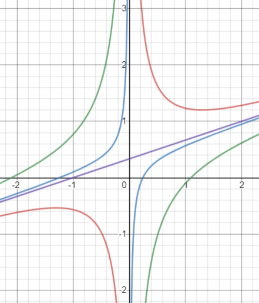

# Examen 2

    <a href="https://ndharari.github.io/MateUTDT/">Página principal</a>

$$
% --Basic Stuff
% Encloses the argument using stretchable parentheses
\newcommand{\pa}[1]{\left( #1 \right) } 
% Encloses the argument using strechable brackets
\newcommand{\br}[1]{\left[ #1 \right] }
% Encloses the argument using strechable curly brackets
\newcommand{\llave}[1]{\left\{#1\right\}}
% leftrightarrow shortcut
\newcommand{\LRA}{\leftrightarrow}
% leftrightarrow shortcut
\newcommand{\RA}{\rightarrow}

% -- Sets and Letters
% Real Numbers
\newcommand{\R}{\mathbb{R}}
% Esperanza
\newcommand{\E}{\mathbb{E}}
% Lagrangeano
\newcommand{\Lagr}{\mathscr{L}}
% Sets
\newcommand{\set}[1]{\mathbb{#1}}

% --Calculus
% Arma una derivada parcial
\newcommand{\pd}[2]{\frac{\partial#1}{\partial#2}}
\newcommand{\von}[1]{\Big|_{#1}}

% -- Algebra
% Bold Letters for vectors
\newcommand{\vv}[1]{\mathbf{#1}}
% Define un sucesión dada una variable y n
\newcommand{\asuc}[2]{#1_1,#1_2,\ldots,#1_{#2}}
% Define un vector horizontal
\newcommand{\hvec}[1]{\langle #1 \rangle}
% Define una matriz grande y chica
\newcommand{\bmat}[1]{\begin{pmatrix}#1\end{pmatrix}}
\newcommand{\smat}[1]{\big(\begin{smallmatrix}#1\end{smallmatrix}\big)}
% Mismo pero para determinantes
\newcommand{\mydet}[1]{\begin{vmatrix}#1\end{vmatrix}}
% Some Operators:
\newcommand{\Ker}{\operatorname{Ker}}
\newcommand{\Img}{\operatorname{Img}}
\newcommand{\Ran}{\operatorname{Ran}}
$$

#### Ejercicio 1. (30 puntos)

> Consideremos la función $f(x; y) = -x^2 + 6x -y^2 - 8y - 28$
>
> 1. Calcular la imagen de $f$.
> 2. Caracterizar las curvas de nivel de esta función.
> 3. Dar tres justificaciones diferentes de que el punto $(3;-4)$ es un mínimo.

1.  La función presentada puede ser representada de la siguiente forma $f(x; y)= -3 - (x-3)^2 - (4 + y)^2$.  Como cada elemento al cuadrado debe ser positivo y estos se encuentran restando, cuando sean cero la función encontrará su valor más elevado, en  $f(x,y)=-3$. Para cualquier otro valor de $\vv{x}$ los elementos al cuadrado son mayores y por lo tanto, $f$ más chico.
   $$
   \Img f= \{z \in\R:z\leq3\}
   $$

2. Las curvas de nivel de la función, expresadas como $f(x; y)= (x-3)^2 + (4 + y)^2=-3-c$ representan circunferencias de radio $r= \sqrt{-3-c}$, donde $c\geq 3$.

3. La primera justificación surge de la geometría de las curvas de nivel $f(x; y)= (x-3)^2 + (4 + y)^2=-3-c$. De esta forma la circunferencia con menor radio se obtiene cuando $r=0\LRA\sqrt{-3-c}=0 \LRA c=3$. Este resultado sólo se obtiene  en el punto $(3, -4)$ y es donde se obtiene el menor valor de la curva de nivel.

   La segunda justificación surge de los teoremas de extremos no condicionados. La condición necesaria mantiene que de existir un extremo este se encontrará en donde $\nabla f=0$. Como
   $$
   \nabla f : \bmat{6-2x\\-2y-8}=0 \LRA \ \begin{align} x&=3 \\y&=-4\end{align}
   $$
   De forma que el punto mencionado $(3, -4)$ es un extremo de la función. Ahora bien, la condición suficiente de extremos plantea que este será un *mínimo* si la **matrix hessiana** de derivadas segundas es definida positiva. Así
   $$
   H= \bmat{2 & 0 \\ 0 & 2}
   $$
   como $|H|= 4>0$ y $2>0$ la matriz está definida positiva y la función es un mínimo. 

#### Ejercicio 3. 20 puntos

> Consideremos la función $ f(x; y) = 16x + y + 3$
> 1. Mediante el método del Lagrange determinar si existen los extremos de $f$ sujetos a la restricción
> $$
> \left\{(x, y) \in \mathbb{R}^{2}: x^{2} y=1\right\}
> $$
>
>
> 2. Mediante el método del Lagrangiano determinar si existen los extremos de $f$ sujetos a la restricción
>
> $$
> \left\{(x, y) \in \mathbb{R}^{2}: x^{2} y=1, y \in[1,9]\right\}
> $$
>

1. El método de Lagrange parte de una función $f\in C^1$ y una curva de nivel $g=c$ con $g\in C^1$. En este caso, ambas condiciones se cumplen ya que $f$ y $g$ son funciones polinómicas.

   Luego, el método plantea que existirá un candidato a extremo cuando $\nabla f=\lambda \nabla g$ de forma que  se calculan ambos gradientes:
   $$
   \nabla f =\lambda\nabla g\LRA \bmat{16 \\ 1} =\lambda\bmat{2xy\\x^2}
   $$
   **Si ocurre que $x\neq 0 \wedge y\neq 0$** entonces $\lambda= \frac{8}{xy}$. Además, con el mismo supuesto sobre $x$ se obtiene que $\lambda=\frac 1 {x^2}$. Igualando ambas expresiones se obtiene que $\frac{8}{xy}=\frac 1 {x^2}\LRA x8=y$. 

   Reemplazando en la restricción se obtiene que $8x^3=1\LRA x=1/2$ de forma que un punto crítico se encuentra en $(1/2; 4)$

   Ahora bien, según el método de Lagrange es necesario chequear también el punto donde el gradiente es nulo, en el punto $(0;0)$. Notar que este punto es el mismo que el mencionado para el despeje inicial.  Como este valor no se encuentra en la superficie de nivel $g=1$ es posible descartarlo como extremo.

2. En este caso, al haber acotado la curva de nivel es necesario analizar los puntos esquina, en este caso reemplazando por cada cota en $y$ se obtiene $(1,1), (-1,1)$ y $(1/3; 9), (-1/3; 1)$.  De forma que se tiene:
$$
\left\{\begin{align}
    f(1/2; 4) = 15 \\
    f(1; 1) = 20\\
    f(-1; 1) = -12 \\
    f(1/3; 9) = 52/3 \approx 17,33\\
    f(-1/3; 9) = 20/3 \approx 6,66
    
   \end{align}\right.
$$
   De forma que $(1; 1)$ es un candidato a máximo absoluto y $(-1; 1) $ candidato a mínimo absoluto .

#### Ejercicio 4. 20 puntos

> Analizar si las siguientes afirmaciones son verdaderas o falsas, justificando adecuadamente.
>
> 1. Si $f(x; y) = (x-3xy)^3$ entonces la recta tangente a la curva de nivel de $f$ en el punto $(1; 0)$ contiene al punto $(-1; 2)$.
> 2. Sea $f(x; y) $ una función tal que
>
> $$
> \frac{\partial f}{\partial\left(\frac{1}{\sqrt{2}}, \frac{1}{\sqrt{2}}\right)}(1,2)=\frac{5}{\sqrt{2}},
> \quad 
> \frac{\partial f}{\partial\left(\frac{3}{5}, \frac{4}{5}\right)}(1,2)=\frac{22}{5}
> $$
>
> entonces la dirección de máximo crecimiento es $\vv{v} = (-2; 7).$
>
> 3. Sea $f(x; y) = x^2 - 3xy + x$, entonces para cada $c \in \R$, la curva de nivel $f(x; y) = c$ es el gráfico de una función de una variable.

1. La la recta tangente a una curva de nivel se obtiene mediante $\nabla f |_{\vv{x}}\cdot (\vv{x}-\vv{x}_0)=0$.  Por lo que la curva de nivel toma la forma:
   $$
   \bmat{3 x^2 (1 - 3 y)^3\\-9 x^3 (1 - 3 y)^2}\cdot\bmat{x-1\\y-0}=0
   $$
   Reemplazando por $(x, y)$ por el punto $(1,2)$ se obtiene:
   $$
   -375\times0=0\\-225\times 2=0
   $$
   Lo cual es un absurdo. Por lo tanto, el punto **no se encuentra en la recta tangente**.

2. Si asumimos que $f$ es una función diferenciable en el punto $(1,2)$ entonces podemos obtener las derivadas en una dirección $\vv{v}$ mediante $\vv{v}\cdot\nabla f|_{\vv{x}_0}$ .  De forma que podemos plantear el siguiente sistema:

$$
\cases{
\pd{f}{x}\frac{1}{\sqrt{2}}+\pd{f}{y}\frac{1}{\sqrt2}= \frac{5}{\sqrt2} \\
\pd{f}{x}\frac{3}{5}+\pd{f}{y}\frac{4}{5}= \frac{22}{5}
}
$$

Cuya solución es $x=-2$ e $y=-7$ y dado que el gradiente es la dirección de máximo crecimiento, **la afirmación es cierta**. 

3. **Esto es cierto**: si se despeja $y=g(x)$ se obtiene $y=\frac x3-\frac c{3x}+\frac{1}{3}$, que está definida para todo valor de $x\neq0$, donde todas las curvas de nivel tienen asíntota vertical. Un caso particular es cuando $c=0$:  allí, el despeje se puede realizar como  $y=\frac x 3 +1/3$, definida en $x=0$.

