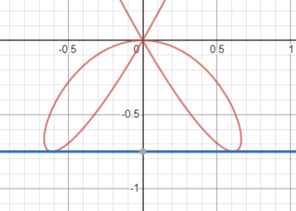

# Examen 3

    <a href="https://ndharari.github.io/MateUTDT/">Página principal</a>

$$
% --Basic Stuff
% Encloses the argument using stretchable parentheses
\newcommand{\pa}[1]{\left( #1 \right) } 
% Encloses the argument using strechable brackets
\newcommand{\br}[1]{\left[ #1 \right] }
% Encloses the argument using strechable curly brackets
\newcommand{\llave}[1]{\left\{#1\right\}}
% leftrightarrow shortcut
\newcommand{\LRA}{\leftrightarrow}
% leftrightarrow shortcut
\newcommand{\RA}{\rightarrow}

% -- Sets and Letters
% Real Numbers
\newcommand{\R}{\mathbb{R}}
% Esperanza
\newcommand{\E}{\mathbb{E}}
% Lagrangeano
\newcommand{\Lagr}{\mathscr{L}}
% Sets
\newcommand{\set}[1]{\mathbb{#1}}

% --Calculus
% Arma una derivada parcial
\newcommand{\pd}[2]{\frac{\partial#1}{\partial#2}}
\newcommand{\von}[1]{\Big|_{#1}}

% -- Algebra
% Bold Letters for vectors
\newcommand{\vv}[1]{\mathbf{#1}}
% Define un sucesión dada una variable y n
\newcommand{\asuc}[2]{#1_1,#1_2,\ldots,#1_{#2}}
% Define un vector horizontal
\newcommand{\hvec}[1]{\langle #1 \rangle}
% Define una matriz grande y chica
\newcommand{\bmat}[1]{\begin{pmatrix}#1\end{pmatrix}}
\newcommand{\smat}[1]{\big(\begin{smallmatrix}#1\end{smallmatrix}\big)}
% Mismo pero para determinantes
\newcommand{\mydet}[1]{\begin{vmatrix}#1\end{vmatrix}}
% Some Operators:
\newcommand{\Ker}{\operatorname{Ker}}
\newcommand{\Img}{\operatorname{Img}}
\newcommand{\Ran}{\operatorname{Ran}}
$$

#### Ejercicio 2. 25 puntos

> Consideremos la función $f(x; y) = 3x^4 + 3x^2y - y^3$.
> 1. ¿Por qué la función no puede tener extremos globales?
> 2. Encontrar los puntos críticos de $f.$ Analizar la naturaleza de cada uno de ellos.
> 3. Considerar la curva de nivel $f(x; y) = 0$.
> - Probar que para todo $x_0 \in \R$ existe $y_0 \in \R$ tal que el punto $(x_0; y_0)$ pertenece a la curva de nivel?
> - ¿Cuál es el menor valor de $y$ para el cuál encontramos puntos $(x; y)$ en la curva de nivel?
>

1. Si se analiza la función para un valor $x_0$ arbitrario  $3 x_0^2(x_0^2+y)-y^3$ se obtiene una función cúbica en $p_3(y)$. Dado que $\Img p_3(y) = \R$ la función no puede tener extremos absolutos.

2. Dado que la condición de extremo libre es $\nabla f = 0$ 
   $$
   \bmat{12x^3+6xy\\3 (x^2 - y^2)}=0
   $$
   Desde esta expresión es posible asegurar que uno de los puntos críticos es $(0,0)$. Para el caso donde $x\neq0$ entonces de la primera fila se obtiene $-2x^2=y$ que reemplazando en la segunda fila se obtiene  $3 x^2 - 12 x^4=0$ que tiene raíces reales en $x_2=1/2$, $x_3=-1/2$. Por lo tanto los puntos críticos son:
   $$
   (0;0), (1/2; -1/2), (-1/2, -1/2)
   $$
   Construimos la matriz hessiana  $H=\smat{6(6x^2+y) & 6x \\6x &-6y}$ para analizar la naturaleza de los puntos críticos. Calculando el determinante, $|H|= -36 (y^2 + x^2 (1 + 6 y))$. De esta forma calculando en los puntos encontramos.
   
   - Para $(0,0)$ tiene primer menor principal $0$ y $|H|=0$, por lo que se encuentra indefinido
   - Para $(1/2; -1/2)$ tenemos  primer menor principal $6$ y $|H|=9$, ambos positivos por lo que es un mínimo local
   - Para $(1/2; -1/2)$ tenemos  primer menor principal $6$ y $|H|=9$, ambos positivos por lo que es un mínimo local
   
   $$
   \bmat{6(6x^2+y) & 6x \\6x &-6y}
   $$
   
3. - Si se considera $f(x_o; y) = 3x_0^4 + 3x_0^2y - y^3=0$ obtenemos una ecuación cúbica en $y$, la cual tendrá solución para cualquier valor real de $x_0$ dado que la imagen de una función cúbica son todos los reales.

   - Si se considera $f(x; y_0) = 3x^2(x^2+y_0)- y_0^3=0$ obtenemos una ecuación polinómica de 4 grado. en $x$. Si proponemos $a=x^2$ de forma de tener una ecuación cuadrática $p_2(a)=3a^2+ay_0- y_0^3=0$ obtenemos el discriminante $\Delta_a=3(4y_0^3+3y_0^2)$. De esta forma el menor valor que $y_0$ puede tomar es cuando $\Delta_a=0\LRA y=-3/4$. 

#### Ejercicio 3. 20 puntos

> Consideremos la función $ f(x; y) = 2y - x + 1.$
> 1. Mediante el método de Lagrange determinar si existen los extremos de $f$ en la región
> $$
> \left\{(x, y) \in \mathbb{R}^{2}: y+x^{2}-x=1\right\}
> $$
>
>
> 2. Mediante el método de Lagrange determinar si existen los extremos de $f$ en la región
>
> $$
> \left\{(x, y) \in \mathbb{R}^{2}: y+x^{2}-x=1, y \geq 0\right\}
> $$
>

1. En primer lugar, es posible aplicar el método de Lagrange dado que $f\in C^1$ y la función $g(x,y)=y+x^2-x$ también lo es. De esta forma es decir que podremos encontrar candidatos a extremos cuando $\nabla f=\lambda\nabla g$. Calculando ambos gradientes:
   $$
   \nabla f =\lambda\nabla g\LRA \bmat{-1 \\ 2} =\lambda\bmat{2x-1\\1}
   $$
   de forma que $\lambda=2$ , $x=\frac{1}{4}$. Reemplazando en la restricción se obtiene que $y=\frac{19}{16}$ con $f(\frac14; \frac{19}{16})=\frac{25}{8}$.

2. En este nuevo caso, $f$ es una función continua en un conjunto cerrado (ya que es el gráfico de una función) y acotado (tiene cuota superior dada por la imagen e inferior por la restricción de no negatividad. El teorema Weierstrass dice que entonces la función restringida encontrará mínimos y máximos. Para encontrar el punto crítico restante, se evalúa en la cota inferior $y=0\LRA x_1=\frac{1}{2} - \frac{\sqrt5}2, x_2=\frac{1}{2} + \frac{\sqrt5}2$. Evaluando en $f(0,\frac{1}{2} - \frac{\sqrt5}2)=\frac{1}{2} - \frac{\sqrt5}2$ y $f(1,\frac{1}{2} + \frac{\sqrt5}2)=\frac{1}{2} - \frac{\sqrt5}2$. Este último resulta mínimo y el encontrado en el punto anterior máximo de  $f$.

#### Ejercicio 4. 20 puntos

> Analizar si las siguientes afirmaciones son verdaderas o falsas, justificando adecuadamente.
>
> 1. Si $f(x; y) = (x-3xy)^3$ entonces la recta tangente a la curva de nivel de $f$ en el punto $(1; 0)$ contiene al punto $(-1; 2)$.
> 2. La función $f(x,y)=\cases{\frac{x^3y}{x^6+y^2} &\text{ si $x,y \neq (0;0)$}\\ 0 &\text{ si $x,y = (0;0)$} }$ admite derivadas direccionadas en el origen para toda dirección $v$ y es continua en el origen.
> 3. La función $f(x,y)=(x+y-1)^2+(y-2)^2$ tiene un solo punto crítico en $\R^2$ que resulta en un mínimo global. 
>

1. La la recta tangente a una curva de nivel se obtiene mediante $\nabla f |_{\vv{x}}\cdot (\vv{x}-\vv{x}_0)=0$.  Por lo que la curva de nivel toma la forma:
   $$
   \bmat{3 x^2 (1 - 3 y)^3\\-9 x^3 (1 - 3 y)^2}\cdot\bmat{x-1\\y-0}=0
   $$
   Reemplazando por $(x, y)$ por el punto $(1,2)$ se obtiene:
   $$
   -375\times0=0\\-225\times 2=0
   $$
   Lo cual es un absurdo. Por lo tanto, el punto no se encuentra en la recta tangente.

2. Comenzaremos por demostrar continuidad. Para esto
   $$
   \lim_{\vv{x}\to \vv{0}}f=f(\vv{x}_o)
   $$

De forma que calculamos el límite de la función en el origen. Aproximando por tres direcciones:

$$
\begin{align}
&\text{Eje x: } y=0 &&\text{Eje y: } x=0	&&\text{Curva } x^3=y \\ 
&\lim_{x\to0} \frac{0}{x^6}=0		&&\lim_{y\to0} \frac{0}{y^2}= 0 			&&\lim_{x\to0}\frac{x^6}{x^6+x^6}\\
&&&&&\lim_{x\to0}\frac{x^6}{2x^6}= \frac{1}{2}
\end{align}
$$
De forma que el límite en el punto no se encuentra definido y la función es discontinua. Sin embargo, pueden existir las derivadas direccionales. Considerando la definición respecto a respecto a un vector $v=\hvec{a, b}$ y reemplazando por $f(0,0)=0$ encontramos:
$$
\lim_{h\to0}\frac{f(x_0+ah, y_0+bh)-f(x_0,y_0)}h= \lim_{h\to0}\frac{f(ah,bh)}h\\
\lim_{{h}\to{{0}}}  \frac{\frac{a^2bh^4}{a^6h^6+b^2h^2}}{h} = 
\lim_{{h}\to{{0}}}  \frac{a^2bh^3}{a^6h^4+b^2}= \frac{0}{b^2}=0
$$
Por lo que existen todas las derivadas direccionales en el origen.

3. Sabemos que la condición de extremo libre es

   $$
   \nabla f =\bmat{x+y-1 \\ x+2y-3}= \vv{0}
   $$

Por lo  que el único punto crítico se encuentra en $(-1,2)$ . Como $f(-1;2)=0$ y $f$ es la suma de dos elementos al cuadrado, entonces  es el punto crítico debe ser un mínimo global.

