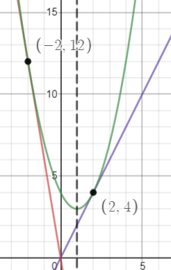

# Examen 4

    <a href="https://ndharari.github.io/MateUTDT/">Página principal</a>

$$
% --Basic Stuff
% Encloses the argument using stretchable parentheses
\newcommand{\pa}[1]{\left( #1 \right) } 
% Encloses the argument using strechable brackets
\newcommand{\br}[1]{\left[ #1 \right] }
% Encloses the argument using strechable curly brackets
\newcommand{\llave}[1]{\left\{#1\right\}}
% leftrightarrow shortcut
\newcommand{\LRA}{\leftrightarrow}
% leftrightarrow shortcut
\newcommand{\RA}{\rightarrow}

% -- Sets and Letters
% Real Numbers
\newcommand{\R}{\mathbb{R}}
% Esperanza
\newcommand{\E}{\mathbb{E}}
% Lagrangeano
\newcommand{\Lagr}{\mathscr{L}}
% Sets
\newcommand{\set}[1]{\mathbb{#1}}

% --Calculus
% Arma una derivada parcial
\newcommand{\pd}[2]{\frac{\partial#1}{\partial#2}}
\newcommand{\von}[1]{\Big|_{#1}}

% -- Algebra
% Bold Letters for vectors
\newcommand{\vv}[1]{\mathbf{#1}}
% Define un sucesión dada una variable y n
\newcommand{\asuc}[2]{#1_1,#1_2,\ldots,#1_{#2}}
% Define un vector horizontal
\newcommand{\hvec}[1]{\langle #1 \rangle}
% Define una matriz grande y chica
\newcommand{\bmat}[1]{\begin{pmatrix}#1\end{pmatrix}}
\newcommand{\smat}[1]{\big(\begin{smallmatrix}#1\end{smallmatrix}\big)}
% Mismo pero para determinantes
\newcommand{\mydet}[1]{\begin{vmatrix}#1\end{vmatrix}}
% Some Operators:
\newcommand{\Ker}{\operatorname{Ker}}
\newcommand{\Img}{\operatorname{Img}}
\newcommand{\Ran}{\operatorname{Ran}}
$$

#### Ejercicio 2. 25 puntos

> Consideremos la función $f(x; y) = -x^3y^2 + x^2 - \sin(xy)$.
> 1. Considerar la curva de nivel $f(x,y)=0$
>    - Probar que para todo $y_0\in \R$ existe un $x_0\in \R$ tal que el punto $(x_0, y_0)$ pertenece a la curva de nivel
>    - Determinar si la curva de nivel tiene puntos de la forma $(-1; y_0)$ y puntos de la forma $(-2; y_0)$
>    - Demostrar que la curva de nivel no contiene puntos $(x; y)$ tales que $x$ sea menor que $(-1)$.
> 3. Determinar si $f$ admite una curva de nivel $114$. 
> 3. Calcular la imagen de la función $f$.

1. - Consideremos el caso donde $x=0$ por lo que $f(0,0)=0$ para todo valor de $y$. De esta forma es posible asegurar que para todo $y$ existe al menos un $x_0\in \R$ en la curva de nivel, $x_0=0$. 
   - Evaluamos en el primer caso $f(-1, y)=y^2+1+\sin(y)=0$. Ahora bien, si $y=0$ obtenemos que $1+\sin(0)=0$ lo cual es un absurdo. Si consideramos el caso donde $y\neq0$ entonces $\sin(y)=-y^2-1$ también encontramos un absurdo: la función $g(y)=-y^2-1, y\neq0$ tiene imagen  $\Img g(y)=\{z\in \R:z<1\} $ . Pero como la imagen del seno es $\{z\in \R:-1\leq z\leq1\}$ no hay solución. De forma equivalente, $f(-2, y)=8y^2+4+2\sin(2y)=0 \LRA \sin(2y)=-4-8y^2$ y este caso la curva de nivel tampoco existe, dado que el mayor valor de la expresión de la izquierda es $h(y)=-4$.
   - Podemos generalizar el razonamiento del punto anterior. Consideremos $x_0=-a$ con $a>1$; la curva de nivel resulta $f(-a; y) = a^3y^2 + a^2 = \sin(-ay)$ . Note que $a^3y^2 + a^2>a^2>1$ y como la función seno tiene imagen acotada ambas expresiones no pueden ser iguales.

   2. Para eso, calculamos la curva de nivel y proponemos $x=-1$ para obtener: $f(1; y) = y^2 +\sin(y)= 115$ . Mirando solo el lado izquierdo de la función, podemos decir que es una suma de funciones continuas, entonces $g(y)=y^2+\sin y$ también lo es. Mediante el Teorema del Valor Medio podemos argumentar lo siguiente: si $g(0)=0<115$ y $g(11)\approx 121.19>115$ entonces debe de haber un valor intermedio que cumpla la condición. Por lo tanto, demostramos que para $x=1$ existe la curva de nivel $114$ de la función.
   3. Para calcular la imagen asumimos $y=1$ sin perdida de generalidad. En este caso $f(x; 1) = -x^3 + x^2 - \sin(x)$ que resulta la suma de función cúbica en $x$ (con imagen en todos los reales) y una función acotada. El resultado es una función con rango $\R$. Una forma de apreciar esto es mediante límites. Note que $\lim_{x\to\infty^+}f=\infty^-$ y $\lim_{x\to\infty^-}f=\infty^+$ de forma que la imagen de la función son efectivamente todos los reales.

> Consideremos la función $ f(x; y) = \frac{2x}{y}- 1$.
> 1. Mediante el método del Lagrange determinar si existen los extremos de $f$ en la región
> $$
> \left\{(x, y) \in \mathbb{R}^{2}: x^2 - 2x + 4 - y = 0\right\}
> $$
>
>
> 2. Mediante el método del Lagrangiano determinar si existen los extremos de $f$ en la región
>
> $$
> \left\{(x, y) \in \mathbb{R}^{2}: x^2 - 2x + 4 - y = 0, x \geq 0\right\}
> $$
>

1. El método de Lagrange parte de una función $f\in C^1$ y una curva de nivel $g=c$ con $g\in C^1$. En este caso, ambas condiciones se cumplen ya que $f$ y $g$ son funciones polinómicas.

   Luego, el método plantea que existirá un candidato a extremo cuando $\nabla f=\lambda \nabla g$ de forma que  se calculan ambos gradientes:
   $$
   \nabla f =\lambda\nabla g\LRA \bmat{\frac{2}{y} \\ \frac{-2x}{y^2}} =\lambda\bmat{2(x-1)\\-1}
   $$
   De esta forma obtenemos el sistema $\cases{\frac{2}{y}=2\lambda(x-1)\\\frac{-2x}{y^2}=-\lambda}$. Reemplazando en la primera expresión por $\lambda$ se obtiene $\frac{2}{y}=\frac{4x}{y^2}(x-1)\LRA y=2x(x-1)$. Reemplazando en la restricción obtenemos $x^2 - 2x + 4 - 2x(x-1) = 0\LRA-(x-2)(x+2)=0$ de forma que tenemos puntos críticos en $(2;4),(-2;12)$.

   Ahora bien, según el método de Lagrange es necesario chequear también el punto donde $\nabla g=0$ es nulo que ocurre con $x=1$ Reemplazando en la curva de nivel obtenemos el punto $(1;3)$.  Evaluando estos valores obtenemos:
   $$
   \cases{
   f(2;4)=0\\
   f(-2;12)=- \frac{4}{3}\\
   f(1;3)= -1/3
   }
   $$
   Por lo que $(2,4)$ y $(-2;12)$ son máximos y mínimos de $f$, respectivamente.

   

2. En este nuevo caso, $f$ es una función continua en un conjunto cerrado (ya que es el gráfico de una función) y acotado (tiene cuota superior dada por la imagen e inferior por la restricción de no negatividad. El teorema Wierstrass dice que entonces la función restringida encontrará mínimos y máximos. Como anteriormente el mínimo anteriormente encontrado es inaccesible, evaluamos en la cota inferior $x=0$ y desde  la restricción tenemos $y=4$ . Como $f(0;4)=-1$ podemos aseverar que este nuevo punto es ahora un mínimo.

#### Ejercicio 4. 20 puntos

> Analizar si las siguientes afirmaciones son verdaderas o falsas, justificando adecuadamente.
>
> 1. Existe una función $h(x; y)$ definida en un abierto alrededor de $(1;-1)$ que además es $C^1$ en ese abierto que verifica que $h(1;-1) = 0 $ y la ecuación:
>    $$
>    x^2e^{2h(x;y)} + yh(x; y) = 2
>    $$
>    
>2. Sean $f $y $g$ funciones $C^1$ definidas en un abierto de $\R^2$ que contiene a $(1; 2)$. Supongamos que $g(1; 2) = 3, \nabla g(1; 2) = (3;-4)$ y que $f(1; 2) = -1, \nabla f(1; 2) = (2; 5)$. Entonces existe un punto $(x_0; y_0)$ en la curva de nivel $g = 3$ tal que $f(x_0; y_0) < -1$.
> 
>3. La función $f(x,y)=\cases{\frac{xy}{\sqrt{x^2+y^2}} &\text{si $(x,y)\neq (0,0)$}\\ 0 &\text{si $(x,y)= (0,0)$}}$ no es diferenciable en $(0; 0)$.
> 

1. Reemplazando se obtiene $1^2e^0-1\times0=2\LRA1=2$. La aseveración es **falsa**. 

2. El enunciado plantea que dados los vectores gradientes de una función objetivo y una restricción en un punto específico se puede asegurar que existe un valor menor de la función que en el punto. Esto es equivalente a sostener que el punto en cuestión **no es** un mínimo. Ahora bien, desde el teorema de Lagrange es posible declarar que los puntos críticos de una función estarán donde ambos gradientes sean paralelos (y no se anule $\nabla g$). Por lo que podemos presentar el siguiente sistema:
   $$
   \cases{2=\lambda3\\5=\lambda4}\qquad\text{que no tiene solución en $\lambda$}
   $$
   Lo que implica que el punto en cuestión no es un punto crítico de la función y por lo tanto la afirmación es verdadera.

3. Sabemos que para una función $f$ la definición de derivada requiere las  **matriz de derivadas parciales.**  Por lo tanto, procedemos a calcularlas:

   En el caso de $\pd{f}{x}=\lim_{h\to0} \frac{\frac{h0}{\sqrt{h^2+0^2}}-0}{h}=\lim_{h\to0} \frac{\frac{0}{h}}{h}=0$, mientras que para $\pd{f}{y}=\lim_{h\to0} \frac{\frac{0h}{\sqrt{0^2+h^2}}-0}{h}=\lim_{h\to0} \frac{\frac{0}{h}}{h}=0$ . Sabiendo entonces que ambas existen en el punto, procedemos a verificar diferenciabilidad:
   $$
   \lim _{(x, y) \rightarrow(x_{0}, y_{0})} 
   \frac{f(x, y)-f(x_{0}, y_{0})- \pd{f}{x}|_{x_{0}, y_{0}}(x-x_{0})-
   \pd{f}{y}|_{x_{0}, y_{0}}(y-y_{0})}
   {\|(x, y)-(x_{0}, y_{0})\|}=0 \\
   
   \lim _{(x, y) \rightarrow(x_{0}, y_{0})} 
   \frac{xy}{\sqrt{x^2+y^2}\sqrt{x^2+ y^2}}=\frac{xy}{x^2+y^2}
   $$
   Aproximamos al punto por tres direcciones
   $$
   \begin{align}
   &\text{Eje x: } y=0 &&\text{Eje y: } x=0	&&\text{Recta } x=y \\ 
   &\lim_{x\to0}\frac{0}{y^2}=0	&&\lim_{y\to0}\frac{0}{x^2}
   &&\lim_{x\to0}=\frac{x^2}{2x^2}=\frac{1}{2}
   \end{align}
   $$
   y como el resultado es distinto el límite no se encuentra definido la función no es diferenciable.

