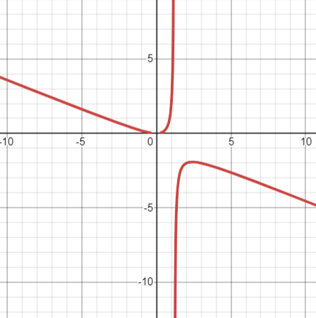
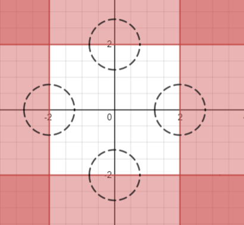

# Examen 5

    <a href="https://ndharari.github.io/MateUTDT/">Página principal</a>

$$
% --Basic Stuff
% Encloses the argument using stretchable parentheses
\newcommand{\pa}[1]{\left( #1 \right) } 
% Encloses the argument using strechable brackets
\newcommand{\br}[1]{\left[ #1 \right] }
% Encloses the argument using strechable curly brackets
\newcommand{\llave}[1]{\left\{#1\right\}}
% leftrightarrow shortcut
\newcommand{\LRA}{\leftrightarrow}
% leftrightarrow shortcut
\newcommand{\RA}{\rightarrow}

% -- Sets and Letters
% Real Numbers
\newcommand{\R}{\mathbb{R}}
% Esperanza
\newcommand{\E}{\mathbb{E}}
% Lagrangeano
\newcommand{\Lagr}{\mathscr{L}}
% Sets
\newcommand{\set}[1]{\mathbb{#1}}

% --Calculus
% Arma una derivada parcial
\newcommand{\pd}[2]{\frac{\partial#1}{\partial#2}}
\newcommand{\von}[1]{\Big|_{#1}}

% -- Algebra
% Bold Letters for vectors
\newcommand{\vv}[1]{\mathbf{#1}}
% Define un sucesión dada una variable y n
\newcommand{\asuc}[2]{#1_1,#1_2,\ldots,#1_{#2}}
% Define un vector horizontal
\newcommand{\hvec}[1]{\langle #1 \rangle}
% Define una matriz grande y chica
\newcommand{\bmat}[1]{\begin{pmatrix}#1\end{pmatrix}}
\newcommand{\smat}[1]{\big(\begin{smallmatrix}#1\end{smallmatrix}\big)}
% Mismo pero para determinantes
\newcommand{\mydet}[1]{\begin{vmatrix}#1\end{vmatrix}}
% Some Operators:
\newcommand{\Ker}{\operatorname{Ker}}
\newcommand{\Img}{\operatorname{Img}}
\newcommand{\Ran}{\operatorname{Ran}}
$$

#### Ejercicio 1. .30 puntos

> Consideremos la siguiente función $f : \R^2 \to\R$ definida por
> $$
> f(x; y) =\frac{3y - x^2}{xy}
> $$
>
> 1. Calcular el dominio y la imagen de $f$.
> 2. Graficar la curva de nivel a la que pertenece el punto $(1; 2)$.
> 3. Encontrar la ecuación de la recta tangente a la curva de nivel del ítem previo en $(1; 2)$.
> 4. Determinar si $f$ crece o decrece más en la dirección $(2; 1)$ o $(1; 3)$ en el punto $(1; 2)$.
>

1. Como toda función racional, esta se encuentra definida en los valores donde el denominador es no nulo, de forma que $\operatorname{Dom} f=\{(x,y)\in\R:x\neq0,y\neq0\}$ .  Respecto a la imagen es todos los número reales. Esto se puede ver proponiendo $y=1$ por lo que $f(x,1)=\frac3x-x$. Calculando los límites $\lim_{x\to\infty^+}f(x,1)=\infty^-$ y $\lim_{x\to\infty^-}f(x,1)=\infty^+$ y considerando existen valores para $f(3,3)=0$ y la discontinuidad puede ser salvada, el teorema de Bolzano plantea que para cualquier punto intermedio existe imagen de la función.

2. La curva de nivel que pertenece a este punto es $f(x,y)=5/2$

   

   3. Para encontrar la ecuación de la recta tangente es necesario calcular el gradiente de la función. De forma que $\nabla f =\hvec{\frac{-3}{x^2}-\frac1y;\frac xy}$ . De esta forma la ecuación de la recta tangente a una curva de nivel se encuentra en:
      $$
      \nabla f |_{\vv{x}}\cdot (\vv{x}-\vv{x}_0)=0 \\
      -\frac{7}{2}(x-1)+\frac{1}{2}(y-2)=0\\
      -\frac{7}{2}x+\frac{1}{2}y+\frac{5}{2}=0
      $$
      
   4. Para verificar la dirección de mayor crecimiento es necesario calcular primero las derivadas direccionales. Para esto, normalizamos las direcciones para no contabilizar el largo de los vectores. Dado que $a=\pa{2,1}\to a_n=\pa{\frac{2}{\sqrt{5}};\frac{1}{\sqrt{5}}}$ y $b=\pa{1,3}\to b_n=\pa{\frac{1}{\sqrt{10}};\frac{3}{\sqrt{10}}}$ . Además, como la función  en el punto es diferenciable (función racional en un punto donde el denominador no es nulo) entonces es posible calcular la derivada direccional mediante el gradiente $\nabla f|_{(1,2)}=(-7/2; 1/2)$ de forma que
      $$
      \pd{f}{\smat{\frac{2}{\sqrt{5}};\frac{1}{\sqrt{5}}}}=
      \bmat{-7/2\\ 1/2}\cdot\bmat{\frac{2}{\sqrt{5}}\\\frac{1}{\sqrt{5}}} = \frac{-13}{2 \sqrt5} \\
      \pd{f}{\smat{\frac{1}{\sqrt{10}};\frac{3}{\sqrt{10}}}}=
      \bmat{-7/2\\ 1/2}\cdot\bmat{\frac{1}{\sqrt{10}}\\\frac{3}{\sqrt{10}}} = -\sqrt\frac{2}{5}
      $$
      

#### Ejercicio 2 25 puntos

> Consideremos la función $f(x, y) = x^3 − 3x^2y + 3xy^2 − y^3$. Mediante el método del Lagrangiano determinar si existen los extremos de $f$ en las siguientes regiones:
>
> 1. $\{(x,y)\in \R^2:(x-3)^2 + (y-1)^2 =9\}$
> 2. $\{(x,y)\in \R^2:(x-3)^2 + (y-1)^2 =9; y>0\}$
> 3. $\{(x,y)\in \R^2:(x-3)^2 + (y-1)^2 =9; y\geq0\}$

1. Comenzamos por expresar a $f$ com0 $f(x,y)=(x-y)^3$. Dado que ésta (ya que es un polinomio) como $g$ ( una cónica) son funciones  $C^1$ es posible aplicar el teorema de Máximos de Lagrange. De esta forma se obtiene:

$$
\nabla f = \lambda \nabla g\\
\text{donde } \nabla f = \bmat{3(x-y)^2\\-3(x-y)^2} \ ; \ \nabla g = \bmat{2x-6\\2y-2}
$$

De forma que
$$
\bmat{3(x-y)^2\\-3(x-y)^2} - \lambda \bmat{2x-6\\2y-2} = \vv{0}
$$
Despejando por $\lambda$ el sistema de ecuaciones se obtiene que tanto $\frac{-3(x-y)^2}{2x-6}=\lambda=\frac{3(x-y)^2}{2y-2}$ siempre y cuando $x\neq 3 \ \wedge \ y\neq 1$.  De esta forma
$$
\frac{-3(x-y)^2}{2x-6}=\frac{3(x-y)^2}{2y-2} \\
-1=\frac{2x-6}{2y-2} \qquad \text{Si } x\neq y \\
x=4-y
$$
Reemplazando en la restricción se obtiene $(1-y)^2 + (y-1)^2 =9$ de forma que $\vv{x}_1=\hvec{3+\frac{3}{\sqrt{2}}; 1-\frac{3}{\sqrt{2}}}$ y $\vv{x}_2=\hvec{3-\frac{3}{\sqrt{2}}; 1+\frac{3}{\sqrt{2}}}$ son los candidatos a óptimo. Sabemos que en estos puntos califica la restricción porque los valores para que $\nabla g =0$ son $\hvec{3, 1}$. Calculando los valores de la función en los puntos críticos se encuentra:
$$
\left\{ \begin{align}{} 
&(1) \ f(\vv{x}_1)=116 + 90\sqrt{2} \approx 243,27\\
&(2) \ f(\vv{x}_2)=116 - 90\sqrt{2} \approx -11,27 \\
&(3) \ f(3,1)=8 \\
&(4) \ f(x=y)=0 \\
\end{align}  \right.
$$
De esta forma encontramos los puntos $(1)$ y $(2)$ como máximo y mínimo respectivamente. Se evalúa en los puntos $(3)$ y $(4)$ por los supuestos realizados anteriormente. Sin embargo, como los valores son intermedios, no afectan al resultado.

2. La nueva restricción recorta la superficie de nivel para todos los puntos tales que $y>0$. Observando los puntos críticos obtenidos en el punto anterior es posible asegurar que el punto mínimo antes encontrado se mantiene (ya que su valor de $y>0$) pero no es el caso del punto máximo. Como la función objetivo $f(x,y)= (x-y)^3$ es decreciente en $y$, podemos decir que en el menor valor posible de esa variable en este nueva superficie reducida será el máximo. Sin embargo, la restricción inferior para esta variable es un intervalo abierto, por lo que no se puede encontrar máximo.  $\blacksquare$
3. Siguiendo el razonamiento planteado en el inciso anterior, si el máximo se encuentra en el menor valor posible de $y$, entonces en este nueva superficie de nivel donde $y=0$ está dentro del conjunto factible se puede asegurar que el punto $\vv{x}_3=(x_3,0)$ es en el cual la función encontrará máximo. Ahora bien, en este punto claramente no se va a cumplir el caso de $\nabla f = \lambda \nabla g$ ya que la ortogonalidad ocurre en el caso antes encontrado. En su lugar, el punto máximo se dará donde $g(x,0):(x-3)^2 + (0-1)^2 =9\LRA \vv{x}_3=(1.72,0)$

#### Ejercicio 3

> Consideremos la función $f(x, y, z) = y^2 + 2y + xz − z − 4z^3 − 3$.
>
> 1. Demostrar que existe una función $g : U \subset \R^2 \to \R $ que resulta $C^1$, definida en un entorno $U $ de $(0, 2)$ tal que $g(0, 2) = 1$ y que $f(x, y, g(x, y)) = 0$ en $U$.
> 2. Hallar el plano tangente a $g$ en el punto $ (0, 2)$.

1. El teorema de la función implícita requiere que la función inicial $f(x,y,z)$ sea $C^1$. Como esta es una suma de funciones de esta categoría, entonces esta también lo es. Como el enunciado plantea calcular $z=g(x,y)$ calculamos la derivada parcial de $\pd{f}{z}=x-12z^2-1|_{0,2,1}=-13\neq0$ . Como es no nula, podemos asegurar que existe una función $z=g(x,y)$ definida en el entorno del punto $(0,2)$ tal que satisface $f(x,y,g(x,y))=0$.

2. El plano tangente a una curva de nivel esta dado por $z=g(0,2)+\pd{g}{x}|_{0,2}x+\pd{g}{y}|_{0,2}(y-2)$, por lo que es necesario encontrar las derivadas de $g$ con respecto a $x$ e $y$. Afortunadamente, estas se pueden encontrar mediante el teorema de la función implícita sabiendo que $\pd{f}{x}|_{(0,2,1)}=z|_{(0,2,1)}=1$ y $\pd{f}{y}|_{(0,2,1)}=2(y+1)|_{(0,2,1)}=6$, de forma que
   $$
   \pd{g}{x}= \frac{\partial f/\partial x}{\partial f/\partial z}\Big|_{(0,2,1)}=\frac{1}{-13}\\
   \pd{g}{y}= \frac{\partial f/\partial y}{\partial f/\partial z}\Big|_{(0,2,1)}=\frac{6}{-13}
   $$
   y la ecuación del plano tangente toma la forma:

$$
z=1-\frac{1}{13}x-\frac{6}{13}(y-2)
$$

#### Ejercicio 4. 20 puntos

> Analizar si las siguientes afirmaciones son verdaderas o falsas, justificando adecuadamente.
>
> 1. Dada la función $f(x; y) = (2x^2 - (a^2- 1)y)^2$, consideremos la recta tangente a la curva de nivel de $f$ que pasa por $(1; 0)$. Los únicos valores de $a$ para los cuales la recta contiene a $(7; 8)$ son $2$ y $-2$.
> 2. La función $f(x,y)=\cases{\frac{x^2y}{x^4+2y^2}\ &\text{si $(x,y)\neq (0,0)$}\\ 0  &\text{si $(x,y)= (0,0)$}}$  es continua en el origen.
>
> 3. Si la función $f(x; y)$ es continua en $(x; y) = (1; 2)$ entonces la función:
>    $$
>    h(x; y) = \pa{(x - 1)^2 + (y - 2)^2}f(x; y)
>   $$
>    es diferenciable en $(1,2)$.
>
> 4. El conjunto $\{f(x; y) \in \R^2 : |x| < 2, |y| < 3\} $ es abierto.

1. La recta tangente a $f$ en el punto está dada por $\nabla f |_{\vv{x}_0}\cdot (\vv{x}-\vv{x}_0)=0$ de forma que es necesario calcular las derivadas parciales en el punto
   $$
   \nabla f|_{(1,0)}=\bmat{16x^2-8y(a^2-1)\\-2(a^2-1)(2x^2 - y(a^2- 1))}\Big|_{(1,0)}=\bmat{16\\4-4a^2}
   $$
   entonces la recta toma la forma $16(x-1)+(4-4a^2)y=0$  y si la recta debe contener al punto $(7; 8)$ entonces $16(7-1)+(4-4a^2)8=0$ resulta una ecuación cuadrática en $a$ con solución $a_1=-2$, $a_2=2$.
   
2. Para verificar continuidad es necesario que el límite conforme $\vv{x} \to \vv{x}_0$ exista y sea igual al valor de la función en el punto. Para eso, calculamos el límite de la función $f(x,y)=\cases{\frac{x^2y}{x^4+2y^2}\ &\text{si $(x,y)\neq (0,0)$}\\ 0  &\text{si $(x,y)= (0,0)$}}$ tendiendo al origen por tres direcciones: 

$$
\begin{align*}
&\text{Eje x: } y=0      &  &\text{Eje y: } x=0    &    &\text{Curva } x^2=y \\ 
  &\lim_{x\to0} \frac{0}{x^4}= 0  &  &\lim_{y\to0}\frac{0}{2y^2}=0  &  
  &\lim_{x\to0}  = \frac{x^4}{x^4+2x^4}\\
  &&&&& \lim_{x\to0}  = \frac{x^4}{3x^4}=\frac{1}{3}
\end{align*}
$$
De forma que el límite en el punto no se encuentra definido y la función es discontinua.

3. Para probar diferenciabilidad, primero se requiere la existencia de derivadas parciales, las cuales se buscarán por definición:
   $$
   \begin{align}
   \pd{f}{x}|_{(1,2)}&=\lim_{h\to0} \frac{\pa{(1+h - 1)^2 + (2 - 2)^2}f(1+h; y)-\pa{(1 - 1)^2 + (2 - 2)^2}f(x; y)}{h}\\
   &=\lim_{h\to0} \frac{h^2f(1+h; 2)}{h}=\lim_{h\to0}{hf(1+h; 2)}=0\\
   
   \pd{f}{y}|_{(1,2)}&=\lim_{h\to0} \frac{\pa{(1 - 1)^2 + (2+h - 2)^2}f(1; y+h)-\pa{(1 - 1)^2 + (2 - 2)^2}f(x; y)}{h}\\
   &=\lim_{h\to0} \frac{h^2f(1; 2+h)}{h}=\lim_{h\to0}{hf(1;2+h)}=0\\
   \end{align}
   $$
   Por lo que $\pd{f}{x}|_{(1,2)}=\pd{f}{y}|_{(1,2)}=0$. Ahora, utilizamos estas derivadas para calcular la diferenciabilidad de $f$:
   $$
   \lim _{(x, y) \rightarrow(1,2)} 
   \frac{\pa{(x - 1)^2 + (y - 2)^2}f(x; y)-\pa{(1 - 1)^2 + (2 - 2)^2}f(1; 2)}
   {\|\hvec{x,y}-\hvec{1,2}\|} \\
   \lim _{(x, y) \rightarrow(1,2)} 
   \frac{\pa{(x - 1)^2 + (y - 2)^2}f(x; y)}
   {{\|\hvec{x,y}-\hvec{1,2}\|}}= \lim _{(x, y) \rightarrow(1,2)} 
   \frac{{\|\hvec{x,y}-\hvec{1,2}\|^2}f(x; y)}
   {{\|\hvec{x,y}-\hvec{1,2}\|}}\\
   \lim _{(x, y) \rightarrow(1,2)} 
   \|\hvec{x,y}-\hvec{1,2}\|f(x; y)=0
$$
   Por lo que la función es diferenciable.
   
4. Si un conjunto es abierto, entonces su complemento debe ser cerrado. Consideremos el conjunto $A= \{f(x; y) \in \R^2 : |x| \geq 2, |y| \geq 3\} $ y trataremos de probar que es cerrado porque contiene a su frontera, la que proponemos como $\partial A=\{ f(x,y)\in \R :|x| =2, |y| = 3\}$ y que pertenece a $A$. Desde un punto arbitrario $\vv{x_0}\in \partial A$ es posible construir una bola abierta $B_\epsilon(\vv{x_0})$. Particularmente, esta bola incluirá puntos de la forma $(|x|+\epsilon, |y|+\epsilon)$  que estarán dentro de $A$ cuando $x>0, y>0$ y fuera en el caso contrario.  A su vez, incluirá puntos de la forma $(|x|-\epsilon, |y|-\epsilon)$ en los que ocurre el caso contrario: estarán dentro de $A$ cuando $x<0, y<0$ y fuera en la inversa. De esta forma, podemos asegurar que $\partial A$ es frontera de $A$ y como está subscripto en él, $A^c$ es abierto, que es lo que buscábamos demostrar.

