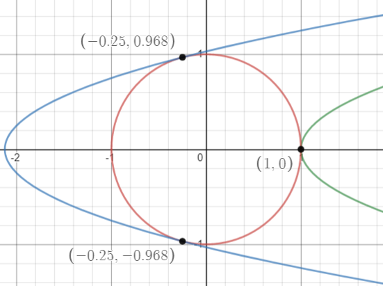
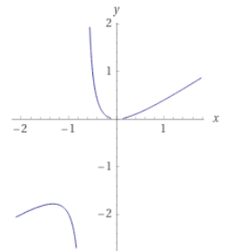
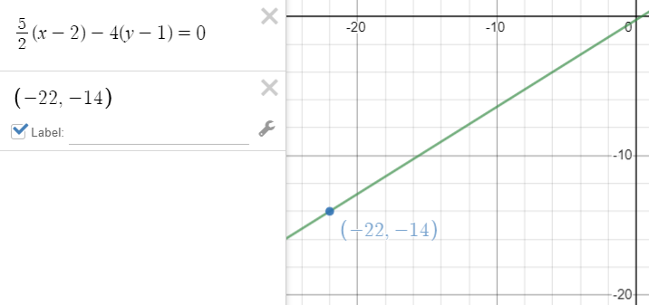

## Examen 6

    <a href="https://ndharari.github.io/MateUTDT/">Página principal</a>

$$
% --Basic Stuff
% Encloses the argument using stretchable parentheses
\newcommand{\pa}[1]{\left( #1 \right) } 
% Encloses the argument using strechable brackets
\newcommand{\br}[1]{\left[ #1 \right] }
% Encloses the argument using strechable curly brackets
\newcommand{\llave}[1]{\left\{#1\right\}}
% leftrightarrow shortcut
\newcommand{\LRA}{\leftrightarrow}
% leftrightarrow shortcut
\newcommand{\RA}{\rightarrow}

% -- Sets and Letters
% Real Numbers
\newcommand{\R}{\mathbb{R}}
% Esperanza
\newcommand{\E}{\mathbb{E}}
% Lagrangeano
\newcommand{\Lagr}{\mathscr{L}}
% Sets
\newcommand{\set}[1]{\mathbb{#1}}

% --Calculus
% Arma una derivada parcial
\newcommand{\pd}[2]{\frac{\partial#1}{\partial#2}}
% Valued on
\newcommand{\von}[1]{\Big|_{#1}}

% -- Algebra
% Bold Letters for vectors
\newcommand{\vv}[1]{\mathbf{#1}}
% Define un sucesión dada una variable y n
\newcommand{\asuc}[2]{#1_1,#1_2,\ldots,#1_{#2}}
% Define un vector horizontal
\newcommand{\hvec}[1]{\langle #1 \rangle}
% Define una matriz grande y chica
\newcommand{\bmat}[1]{\begin{pmatrix}#1\end{pmatrix}}
\newcommand{\smat}[1]{\big(\begin{smallmatrix}#1\end{smallmatrix}\big)}
% Mismo pero para determinantes
\newcommand{\mydet}[1]{\begin{vmatrix}#1\end{vmatrix}}
% Some Operators:
\newcommand{\Ker}{\operatorname{Ker}}
\newcommand{\Img}{\operatorname{Img}}
\newcommand{\Ran}{\operatorname{Ran}}
$$

#### Ejercicio 1. (25 puntos)

> Sea la función $f: \mathbb{R}^{2}\rightarrow \mathbb{R}$ definida por $f(x,y)=2y^{2}-x$. Mediante el método del Lagrangiano determinar si existen los extremos absolutos y locales de $f$ en las siguientes regiones.
>
> 1. $\{(x,y)\in \mathbb{R}^{2}: x^{2} + y^{2} = 1\}$.
>2. $\{(x,y)\in \mathbb{R}^{2}: x^{2} + y^{2} = 1, x \geq 0 \}$.

$\mathbf1.$ El método de Lagrange parte de una función $f\in C^1$ y una curva de nivel $g=c$ con $g\in C^1$. En este caso, ambas condiciones se cumplen ya que $f$ y $g$ son funciones polinómicas.

Luego, el método plantea que de existir un extremo de $f$ en $g$ este punto cumplirá la condición  $\nabla f=\lambda \nabla g$  siempre que no sea también un punto crítico de $g$, p.e $\nabla g\von{x_0} \neq 0$. De forma que  se calculan ambos gradientes para resolver la siguiente ecuación:
$$
\nabla f =\lambda\nabla g\LRA \bmat{-1 \\4y } =\lambda \bmat{2x \\2y}
$$

Por lo que obtenemos un sistema de ecuaciones de la forma $\cases {-1=\lambda 2x\\4y=\lambda2y}$. De la segunda  condición podemos concluir que o bien $y=0$ o $\lambda=2$. Reemplazando por $\lambda$ en la primera condición   obtenemos $x=-1/4$ y si se considera la restricción obtenemos los puntos $(-\frac{1}{4};\frac{\sqrt{15}}{4})$ y $(-  \frac{1}{4};-\frac{\sqrt{15}}{4})$. A su vez, si consideramos $y=0$ en la restricción obtenemos el punto $(1,0)$. Ahora bien, según el método de Lagrange es necesario chequear también el punto donde $\nabla g=0$ es nulo que ocurre con $(0,0)$. De esta forma los puntos críticos encontrados y sus valores en $f$ son:

$$
\cases{f(0,0)=0\\
	   f(1,0)=-1 \to \text{ Candidato a mínimo restringido}\\
	   f(-\frac{1}{4};\frac{\sqrt{15}}{4})=\frac{17}{8}\to\text{ Candidato a máximo restringido}\\
	   f(-\frac{1}{4};-\frac{\sqrt{15}}{4})=\frac{17}{8}\to\text{ Candidato a máximo restringido}\\
	   }
$$
   A continuación se presenta el gráfico del problema en cuestión

|  |
| :----------------------------------------------------------: |
|      La función encuentra máximo y mínimo restringido.       |

$\mathbf2.$ En este nuevo caso, $f$ es una función continua en un conjunto cerrado (ya que es el gráfico de una función) y acotado, con cota en la imagen y en la restricción de no negatividad sobre $x$. El teorema Wierstrass dice que entonces la función restringida encontrará mínimos y máximos absolutos. Como anteriormente el máximo anteriormente encontrado es inaccesible, evaluamos en la condición de no negatividad $x=0$ y desde  la restricción tenemos los puntos  $(0,1)$ y $(0,-1)$. Para ambos valores la función encuentra un máximo, con $f(0,1)=f(0,-1)=2$

---

#### Ejercicio 2. (25 puntos)

> Dada la función $f:\mathbb{R}^{2}\rightarrow \mathbb{R}$ definida como $f(x,y) =\frac{2x^{2} - 2y}{xy}$.
> 
>
> 1. Calcular el dominio y la imagen de $f$.  
>2. Graficar la curva de nivel a la que pertenece $(2,1)$. 
> 3. Mostrar que la recta tangente a la curva de nivel $(f= 3)$ en el punto $(2,1)$ pasa por el punto $(-22,-14)$.
>4. Mostrar que $f$ crece más si uno se aleja un poco del punto $(2,1)$ en la dirección $(3,-2)$ que en la dirección $(2,-1)$.
> 5. Mostrar que la curva de nivel $(f=  3)$ es el gráfico de una función $h:\mathbb{R}\rightarrow \mathbb{R}$  que es creciente en $(0,+\infty)$.
> 6. Mostrar que si $g:\mathbb{R}^{2}\rightarrow \mathbb{R}$ es una función que satisface $g(2,1)  =  3$ y que $\nabla g (2,1)  =  (1,1)$, entonces hay un punto en la curva de nivel $(f= 3)$ donde $g$ vale más que 3.

1. Como toda función racional, esta se encuentra definida en los valores donde el denominador es no nulo, de forma que $\operatorname{Dom} f=\{(x,y)\in\R:x\neq0,y\neq0\}$ .  Respecto a la imagen es todos los número reales. Esto se puede ver proponiendo $y=1$ por lo que $f(x,1)=f(x,y) =2(x -\frac{1}{x})$. Calculando los límites $\lim_{x\to\infty^+}f(x,1)=\infty^-$ y $\lim_{x\to\infty^-}f(x,1)=\infty^+$ ya que en ambos casos $\frac{1}{x}\to 0$ y la $x\to \infty^{+,-}$ . Además, considerando que $f(2,4)=0$ y la discontinuidad puede ser salvada, el teorema de Bolzano plantea que para cualquier punto intermedio existe imagen de la función.

2. La curva de nivel a la que pertenece el punto $(2,1)$ será $f(2,1)=3$. Esta curva de nivel  tiene el siguiente gráfico, el cual está discontinuo en el origen

   

3. La ecuación de la recta recta tangente a la función  en el punto $(2,1)$ resulta

    $$
    \pd{f}{x}\von{(2,1)}(x-2)+\pd{f}{y}\von{(2,1)}(y-1)=0
    $$
    De forma que es necesario calcular las derivadas parciales $\pd{f}{x}=2(\frac{1}{x^2}+\frac{1}{y})$ y $\pd{f}{y}=\frac{-2x}{y^2}$. Evaluadas ambas en el punto resultan:
    $$
    \frac{5}{2}(x-2)-4(y-1)=0
    $$
    Ahora, si se reemplaza el punto  $x=-22, y=-14$ es válida la igualdad por lo que el punto se encuentra en la recta tangente

4. Para verificar la dirección de mayor crecimiento es necesario calcular primero las derivadas direccionales. Para esto, normalizamos las direcciones para no contabilizar el largo de los vectores. Dado que $a=(3,-2)\to a_n=\pa{\frac{3}{\sqrt{13}};-\frac{2}{\sqrt{13}}}$ y $b=(2,-1)\to b_n=\pa{\frac{2}{\sqrt{5}};-\frac{1}{\sqrt{5}}}$ . Además, como la función  en el punto es diferenciable (función racional en un punto donde el denominador no es nulo) entonces es posible calcular la derivada direccional mediante el gradiente $\nabla f|_{(2,1)}=\hvec{5/2, -4}$ de forma que

     $$
    \pd{f}{\smat{\frac{3}{\sqrt{13}};-\frac{2}{\sqrt{13}}}}=
    \bmat{5/2\\ -4}\cdot\bmat{\frac{3}{\sqrt{13}}\\-\frac{2}{\sqrt{13}}} = \frac{31\sqrt{13}}{26}\approx4.29 \\
    \pd{f}{\smat{\frac{2}{\sqrt{5}};-\frac{1}{\sqrt{5}}}}=
    \bmat{5/2\\ -4}\cdot\bmat{\frac{2}{\sqrt{5}}\\-\frac{1}{\sqrt{5}}} = \frac{9\sqrt{5}}{5}\approx 4.02
    $$
    Mostrando que ese es efectivamente el caso
    
5. Para esto usamos el teorema de la función implícita y mostraremos que para todo punto $x>0$ la derivada $\pd{h}{x}>0$. Como $f:\R_0^+\to\R\in C^1$ ya que es una función racional sin denominador nulo, es posible aplicar el teorema. Haremos el despeje $y=h(x)$ por lo que necesitamos  que $\pd{f}{y}\neq0$.  Como las derivadas parciales son $\pd{f}{x}=2(\frac{1}{x^2}+\frac{1}{y})$ y $\pd{f}{y}=\frac{-2x}{y^2}$ estas no encuentran valores nulos en el dominio. Obtenemos la derivada deseada mediante:
     $$
     \pd{h}{x}=-\frac{\pd{f}{x}}{\pd{f}{y}}=\frac{(\frac1{x^2} + \frac{1}{y}) y^2}x
     $$
     La cual es creciente para valores positivos de $x, y$.

6. Esto es equivalente a plantear que la maximización de la función $g$ restringida por la curva de nivel $f$ no  encuentra máximo en $(2,1)$. Para esto, planteamos la condición de máximo con los valores propuestos $\smat{5/2\\ -4}=\lambda\smat{1\\ 1}$ y notamos que es un absurdo ya que $\lambda$ debe ser igual a dos valores distintos a la vez. Notar también que como $\nabla g\neq0$ por lo que no debemos preocuparnos por tal situación.

     ---

#### Ejercicio 3. (25 puntos)

> Hallar la solución del siguiente sistema de ecuaciones en diferencias cuyos valores iniciales son $x_{0}=0$ e $y_{0}=3$.
> $$
> \begin{cases}
>  x_{n+1} & = 3x_n+2y_n
>  \\
>  y_{n+1} & = -2(x_n+y_n).
>  \end{cases}
> $$

Para resolver el sistema de ecuaciones resulta conveniente expresar el sistema en términos vectoriales para encontrar una expresión explícita de la solución. De esta forma, obtenemos
$$
\bmat{x_{n+1}\\y_{n+1}}=\bmat{3&2\\-2&-2}\bmat{x_n\\y_n}
$$
Donde llamaremos $A$ a la matriz de coeficientes. Note, que de ser posible re-expresar a $A$ mediante su descomposición espectral $SDS^{-1}$, donde $D$ es una matriz diagonal de autovalores y $S$ la matriz invertible con los correspondientes autovectores, podremos aplicar la siguiente propiedad:
$$
A^{N}=\underbrace{\left(S D S^{-1}\right)\left(S D S^{-1}\right) \ldots\left(S D S^{-1}\right)}_{N \text { veces }}=S D^{N} S^{-1}
$$
y calcular  de forma sencilla la aplicación repetida de la transformación de recurrencia.  Para eso calculamos el polinomio característico de $A$
$$
-2 - λ + λ^2=0 \LRA \lambda_1=-1, \ \lambda_2=2
$$
Encontrando ambos autovalores.  Los autovectores se pueden obtener reemplazando en la definición $A\vv{v}=\lambda\vv{v}$ y resultan $\hvec{-2, 1}$ y $ \hvec{-1,2}$. De forma que la descomposición espectral de $A$ es
$$
\bmat{3&2\\-2&-2} = \bmat{-1 &-2 \\2&1}\bmat{-1& 0 \\0&2}\bmat{\frac{1}{3}&\frac{2}{3}\\ -\frac{2}{3}&-\frac{1}{3}}
$$
Y mediante la propiedad antes descripta podemos hacer 
$$
\bmat{x_{n}\\y_{n}}=\bmat{-1 &-2 \\2&1}\bmat{-1& 0 \\0&2}^n
\bmat{\frac{1}{3}&\frac{2}{3}\\ -\frac{2}{3}&-\frac{1}{3}}\bmat{0\\3} \\
\bmat{x_{n}\\y_{n}}=\frac{1}{3} \bmat{4\times2^n-(-1)^n &-2((-1)^n-2^n)\\2((-1)^n-2^n)&4((-1)^n-2^n)}\bmat{0\\3} \\
\bmat{x_{n}\\y_{n}} = \bmat{2\times2^n-2(-1)^n\\4(-1)^n-2^n}
$$
Por lo que obtenemos que $x_n=2^{n+1}-2(-1)^n$ e $y_n=4(-1)^n-2^n$.

---

#### Ejercicio 4. (25 puntos)

> Analizar si las siguientes afirmaciones son verdaderas o falsas, justificando adecuadamente.
>
> 1. Si $f:\mathbb{R}\rightarrow \mathbb{R}$ una función continua en $0$ tal que $f(0)=-2$, entonces  la función $g(x,y)= f(x + y) (x^{2}+ y^{2})$  es diferenciable en $(0,0)$.
>
> 2. Consideremos una función $g:\mathbb{R} \rightarrow \mathbb{R}$ derivable y tal que $g'(t) > 0$ para todo $t \in \mathbb R$. Las rectas tangentes a las curvas de nivel de la función $f(x,y) = g(3x+4y)$ son paralelas a la recta $L: 4x-3y = 2$.
>
> 3. Si $A$ y $B$ son dos matrices de $4\times 4$ con entradas reales tales que
>    $$
>    A \begin{pmatrix} 1 \\ 2 \\ 3\\4 \end{pmatrix}
>      =
>      B \begin{pmatrix} -1 \\ -2 \\ -3 \\-4 \end{pmatrix},
>    $$
>    entonces el rango de $A + B $ es menor que $10$.
>
> 4. El gráfico de una función continua $f : \mathbb{R}\rightarrow \mathbb{R}$ es un conjunto cerrado.

1. Para responder esto es necesario obtener primero las derivadas parciales evaluadas en el origen. Se plantean entonces los límites de los cocientes incrementales:
   $$
   \pd{g}{x}\von{(0,0)}=\lim_{h\to0} \frac{g(h, 0)-g(0, 0)}h =\lim_{h\to0} \frac{f(h) h^{2}}h=
   \lim_{h\to0}f(h) h=-2\times 0=0\\
   \phantom{\pd{g}{x}}\\
   \pd{g}{x}\von{(0,0)}=\lim_{h\to0} \frac{g(0, h)-g(0, 0)}h =\lim_{h\to0} \frac{f(h) h^{2}}h=
   \lim_{h\to0}f(h) h=-2\times 0=0\\
   $$
   De forma que ambas derivadas parciales de $g$ son nulas en el origen. A continuación, demostramos diferenciabilidad:
   $$
   \lim _{(x, y) \rightarrow(x_{0}, y_{0})} 
   \frac{g(x, y)-g(x_{0}, y_{0})- \pd{g}{x}\von{x_{0}, y_{0}}(x-x_{0})-
   \pd{g}{y}\von{x_{0}, y_{0}}(y-y_{0})}
   {\sqrt{(x-x_{0})^2 + (y- y_{0})^2}} =0\\
   \lim _{(x, y) \rightarrow(x_{0}, y_{0})} 
   \frac{g(x, y)}
   {\sqrt{x^2 + y^2}} =
   \lim _{(x, y) \rightarrow(x_{0}, y_{0})} 
   \frac{f(x + y) (x^{2}+ y^{2})}
   {\sqrt{x^2 + y^2}} \\
   \lim _{(x, y) \rightarrow(x_{0}, y_{0})} 
   \frac{f(x + y) (x^{2}+ y^{2})}
   {\sqrt{x^2 + y^2}} =\lim _{(x, y) \rightarrow(x_{0}, y_{0})} f(x + y) \sqrt{x^{2}+ y^{2}} = 0
   $$
   Como $\lim _{(x, y) \rightarrow(x_{0}, y_{0})} \sqrt{x^{2}+ y^{2}}=0$ entonces se cumple la condición de diferenciabilidad. **Es verdadero.**

2. Es posible calcular de forma genérica las derivadas de la función $f\circ g$ mediante la regla de la cadena. Sea $Df(x,y)=\smat{3\\4}$ la matriz de derivadas parciales de $f$ y considerando que la derivada $g'_t>0$ entonces podemos escribir la derivada de la función $f\circ g$ como $Df(t)\cdot g'_t = (3+4)^T\cdot(g'_t)=7g'_t$. Note que la pendiente de $L$ es  $\frac{4}{3}$, de forma que para que la aseveración sea cierta  $\frac{4}{3}=7g'_t$. Como esto no vale para todo valor posible de $g'_t$, podemos decir que el enunciado es **falso** a menos que $g'_t=\frac{4}{21}$

3. Notar que se presentan dos matrices que tienen a lo sumo rango $4$. La suma de matrices se realiza de entrada a entrada, por lo que el número de filas o columnas máximo que puede tener la matriz resultante $A+B$ sigue siendo $4$. Como este número es menor que $10$, el enunciado **es verdadero.**

4. Esto es **verdadero**.  Para demostrarlo consideraremos el conjunto $A=\{(x,y)\in \R^2|f(x)=y\}$ y utilizaremos la definición de conjunto cerrado que plantea que para serlo $A$ debe contener a su frontera. Recordemos que la frontera  de conjunto son todos los puntos $(x_0, y_0)\in A$ desde los que se puede construir una bola $B_\epsilon(x_0, y_0)$ de radio $\epsilon$ tal que contenga puntos dentro y fuera $A$. Notar que si una función es continua, esta no contiene agujeros o saltos, de forma que si uno se desplaza una distancia $\epsilon$ en cualquier dirección va a encontrar un punto que pertenece también a $A$. A su vez, también encontrará puntos que no se encontrarán en $A$ (gráficamente se puede ver esto como que el gráfico de una función $f : \mathbb{R}\rightarrow \mathbb{R}$ no tiene área). De esta forma, el gráfico de una función continua es un conjunto cerrado.

|  |
| :----------------------------------------------------------: |
|              Ejemplo para la función $f(x)=x^2$              |

