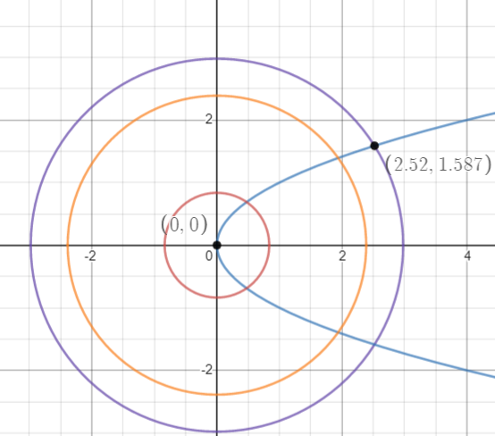

# Ejercicios Varios

    <a href="https://ndharari.github.io/MateUTDT/">Página principal</a>

$$
% --Basic Stuff
% Encloses the argument using stretchable parentheses
\newcommand{\pa}[1]{\left( #1 \right) } 
% Encloses the argument using strechable brackets
\newcommand{\br}[1]{\left[ #1 \right] }
% Encloses the argument using strechable curly brackets
\newcommand{\llave}[1]{\left\{#1\right\}}
% leftrightarrow shortcut
\newcommand{\LRA}{\leftrightarrow}
% leftrightarrow shortcut
\newcommand{\RA}{\rightarrow}

% -- Sets and Letters
% Real Numbers
\newcommand{\R}{\mathbb{R}}
% Esperanza
\newcommand{\E}{\mathbb{E}}
% Lagrangeano
\newcommand{\Lagr}{\mathscr{L}}
% Sets
\newcommand{\set}[1]{\mathbb{#1}}

% --Calculus
% Arma una derivada parcial
\newcommand{\pd}[2]{\frac{\partial#1}{\partial#2}}
% Valued on
\newcommand{\von}[1]{\Big|_{#1}}

% -- Algebra
% Bold Letters for vectors
\newcommand{\vv}[1]{\mathbf{#1}}
% Define un sucesión dada una variable y n
\newcommand{\asuc}[2]{#1_1,#1_2,\ldots,#1_{#2}}
% Define un vector horizontal
\newcommand{\hvec}[1]{\langle #1 \rangle}
% Define una matriz grande y chica
\newcommand{\bmat}[1]{\begin{pmatrix}#1\end{pmatrix}}
\newcommand{\smat}[1]{\big(\begin{smallmatrix}#1\end{smallmatrix}\big)}
% Mismo pero para determinantes
\newcommand{\mydet}[1]{\begin{vmatrix}#1\end{vmatrix}}
% Some Operators:
\newcommand{\Ker}{\operatorname{Ker}}
\newcommand{\Img}{\operatorname{Img}}
\newcommand{\Ran}{\operatorname{Ran}}
$$

### Derivadas parciales y direccionales

> **Ejercicio 7** Calcular la derivada direccional de $f(x; y) = xy^2 + x^3y$ en $(4,-2)$ en la dirección $(\frac{1}{\sqrt{10}}, \frac{3}{\sqrt{10}})$.

- Como $f$ es $C^1$ (suma de funciones polinómicas) entonces es posible obtener la derivada direccional por gradiente
  $$
  \begin{align}
  \pd{f}{\smat{\frac{1}{\sqrt{10}}, \frac{3}{\sqrt{10}}}}\Big|_{(4,-2)}&=\nabla f\von{(4,-2)} \cdot \ \smat{4\\-2} \\
  &=\smat{y^2+3x^2y\\2yx+x^3}\von{(4. -2)}\cdot\smat{4\\-2}=\smat{-92\\0}\von{(4. -2)}\cdot\smat{4\\-2}=368
  \end{align}
  $$
  

> **Ejercicio 8** Sabiendo que $f(2,1)=4$, $\pd{f}{x}|_{(2,1)}=-3$ y $\pd{f}{y}|_{(2,1)}=2$ hallar los valores aproximados de $f(2,002;1)$ , $f(2;1,003)$.

Sabiendo las derivadas parciales y asumiendo que $f(2,1)$ es una función diferenciable, entonces podemos construir una buena aproximación lineal mediante el siguiente plano tangente:
$$
z=f(2,1)+\pd{f}{x}\von{(2,1)}(x-2)+\pd{f}{y}\von{(2,1)}(y-1) \\
z=4+-3(x-2)+2(y-1) \\
$$
De forma que $f(2,002;1)=3.994$ y $f(2;1,003)=4.006$

> **Ejercicio 9** Sea $f: \mathbb{R}^{2} \rightarrow \mathbb{R}$. Apelando a la definición de derivada direccional demostrar las siguientes afirmaciones. Notemos que no sabemos si la función es diferenciable o no en algún punto de $\mathbb{R}^{2}$.
>
> - Si existe $\frac{\partial f}{\partial \mathbf{u}}(x_0)$ entonces $\frac{\partial f}{\partial\mathbf{-u}}(x_0)=-\frac{\partial f}{\partial \mathbf{u}}(x_0)$
>

Sea $\mathbf{u}$ un vector direccional arbitrario y $D_uf(x_0)$ la derivada parcial de $f$ con respecto a $x$ e n el punto $x_0\in\R^2$. Por la definición de derivada parcial se obtiene que:
$$
D_uf(x_0)=  \lim_{h\to0} \frac{f(x_0 + h\mathbf{u})-f(x_0)}{h}
$$
Es posible reemplazar $\mathbf{u}$ por $\mathbf{-u}$ y obtener la dirección buscada:
$$
D_{-u}f(x_0)=  \lim_{h\to0} \frac{f(x_0 - h\mathbf{u})-f(x_0)}{h}
$$
Ahora bien, como $h\to0$ es posible reemplazar en la expresión por otro valor $c=-h$  y como $0=-0$ entonces también ocurre que $c\to0$ 
$$
D_{-u}f(x_0, y_0)=  \lim_{c\to0} \frac{f(x_0 + h\mathbf{u})-f(x_0)}{-c} \\
D_{-u}f(x_0, y_0)=  \lim_{c\to0} -\frac{f(x_0 + h\mathbf{u})-f(x_0)}{c}\\
D_{-u}f(x_0, y_0)=  -D_uf(x_0)
$$

> **Ejercicio 10** Sea $f : \R\to \R$ diferenciable en $(3; 2)$. Sabiendo que $\pd{f}{(4,3)}|_{(3,2)}=3$ y que $\pd{f}{(3,4)}|_{(3,2)}=-5$ calcular las derivadas parciales de $f $ en $(3; 2).$

Si $f$ es diferenciable entonces es posible encontrar las derivadas direccionales mediante $\pd{f}{\vv{v}}\von{\vv{x}_0}=\nabla f\von{\vv{x}_0} \cdot \ \vv{v} $. por lo que podemos proponer el siguiente sistema de ecuaciones:
$$
\cases{3 = \pd{f}{x}\von{(3,2)}4+\pd{f}{y}\von{(3,2)}3\\-5 = \pd{f}{x}\von{(3,2)}3+\pd{f}{y}\von{(3,2)}4}
\to \begin{align}&\pd{f}{x}=\frac{27}{7}\\ &\pd{f}{y}=\frac{-29}{7}\end{align}
$$

> **Ejercicio 11** Encontrar en cuál dirección, desde el punto $(2; 3)$, la función $f(x; y) = 4x^2y$ crece más rápidamente. Expresar la respuesta como un vector de longitud $1$.

Por propiedad del vector gradiente, sabemos que es la dirección de máximo crecimiento de una función en un punto. Por lo que calculamos $\nabla f\von{(2,3)}=\hvec{8xy, 4x^2}=\hvec{48, 16}$. Sabiendo que la norma de este vector es $\sqrt{48^2+16^2}=16\sqrt{10}$ dividimos al gradiente para obtener un vector unitario: $\hvec{\frac{3}{\sqrt{10}};\frac{1}{\sqrt{10}} }$.

### Regla de la cadena

> **Ejercicio 12** Sea $f(x; y; z) = (xyz; xy; z)$, $x_t = t^2, y_t = 2t, z_t = t + 1$ y $g(t) = f(x_t; y_t; z_t)$.
>
> - Calcule $Dg(t)$ usando la regla de la cadena.

Sean $f:\R^3\to\R^3, (x,y,z)\mapsto (xyz, xy, z)$ , $h:\R\to\R^3, t\mapsto(t^2,2t, t+1)$ y $g:\R\to\R^3, f\circ h$ la derivada de $g$ con respecto a $t$, denotada $Dg(t)$ se obtiene como la multiplicación  $Df(x_t,y_t,z_t)\times Dh(t)$
$$
Dg(t)=\bmat{yz&xz&xy\\y&x&0\\0&0&1}  \times \bmat{2t\\2\\1}\\
Dg(t)=\bmat{2t^2+2t&t^3+t^2&2t^3\\2t&t^2&0\\0&0&1}  \times \bmat{2t\\2\\1}\\
Dg(t)=\bmat{8t^3+6t^2\\6t^2 \\ 1}
$$

> **Ejercicio 13** Sea $f(x, y)=\left(e^{x-y}, e^{x y}\right)$ y $g(u, v)=\left(\frac{u^{2}+v^{2}}{u^{2}-v^{2}}, 2 u v, 3 u^{2} v\right) .$ Calcular $D(g \circ f)\von{(a, b)}$ eligiendo un $(a, b)$ adecuado (es decir, que se verifiquen las hipótesis bajo las cuales es válida la regla de la cadena).

Para que la regla de la cadena sea válida, ambas derivadas deben estar  definidas en los puntos seleccionados. En este caso, se requiere $u\neq v$, por lo que $x-y\neq xy$. Procedemos a calcular las derivadas, recordando que $D(g \circ f)\von{(a, b)}=Dg(u,v)\times Df(x,y)$. Proponemos el punto $(1,0)$ y notamos que $f(1,0)=(e,1)$
$$
Df\von{(1,0)}=\bmat{e^{x-y} & -e^x-y \\ye^xy&xe^xy}\von{(1,0)}= 
\bmat{e & -e \\0 & 1}\\
Dg\von{e,1}=\bmat{\frac{4uv^2}{(u^2-v^2)^2} & \frac{4u^2v}{(u^2-v^2)^2}\\2v&2u\\6uv&3u^2}\von{(e,1)}=
\bmat{\frac{4e}{(e^2-1)^2}&\frac{4e^2}{(e^2-1)^2}\\2&2e\\6e&3e^2}
$$
Por lo que obtenemos:
$$
D(g\circ f)\von{0,1} =\bmat{\frac{4e}{(e^2-1)^2}&\frac{4e^2}{(e^2-1)^2}\\2&2e\\6e&3e^2} \times \bmat{e & -e \\0 & 1} = 
\bmat{\frac{4e^2}{(e^2-1)^2} & 0\\2e & 0\\6e^2 & 3e^2}
$$

### Ejemplos patológicos

> **Ejemplo 0.** Derivadas direccionales de $f(x,y)=x^2y^3-x$ en la dirección $v=(2,1)$ en el punto $(1,1)$

$$
\pd{f}{(2,1)}\von{\vv(1,1)}=\lim_{h\to0} \frac{(1+2h)^2(1+1h)^3-(1+2h)}h = \lim_{h\to0} \frac{5 h + 19 h^2 + 25 h^3 + 16 h^4 + 4 h^5}h \\
\lim_{h\to0} 5  + 19 h + 25 h^2 + 16 h^3 + 4 h^4 = 5
$$

> **Ejemplo 1.2**. El ejemplo clásico de una función continua en un punto pero no diferenciable
> en ese punto:
> $$
> f(x,y)=\cases{\frac{xy}{\sqrt{x^2+y^2}} &\text{si $(x,y) \neq 0$}\\
> 0 &\text{si $(x,y) = 0$}}
> $$

La función es continua en el origen. Esto se puede observar aplicando el criterio del sandwich. Aplicamos módulo para analizar a la vez el caso negativo y positivo de la función $\frac{|xy|}{\sqrt{x^2+y^2}}$. Es fácil ver que esta expresión es estrictamente positiva. Además, tambien sabemos que esta expresión es también menor a $\sqrt{x^2+y^2}$. De forma que se puede expresar la siguiente inecuación
$$
0\leq \frac{|xy|}{\sqrt{x^2+y^2}} \leq \sqrt{x^2+y^2}
$$
Como ambos lados de la expresión tienden a cero conforme $(x,y)\to (0,0)$ entonces la función también lo hace. Para demostrar diferenciabilidad es necesario conocer las derivadas parciales de $f$ para eso:
$$
\pd{f}{x}\von{(0,0)}=\lim_{h\to0} \frac{\frac{0}{\sqrt{h^2}}}{h} =0 \\
\pd{f}{y}\von{(0,0)}=\lim_{h\to0} \frac{\frac{0}{\sqrt{h^2}}}{h} =0
$$
Ahora bien, la diferenciabilidad se obtiene con la siguiente expresión:
$$
\lim _{(, y) \rightarrow(0,0)} 
\frac{\frac{xy}{\sqrt{x^2+y^2}}}
{\|(x, y)\|}=\lim _{(x, y) \rightarrow (0 , 0)} 
\frac{xy}{x^2+y^2}
$$

> **Ejercicio 1.** Consideremos la siguiente función $f(x,y)=\cases{\frac{x^3y}{x^6+y^2}  & \text{si $(x,y)\neq(0,0)$}\\
> 0 & \text{si $(x,y)=(0,0)$}}$, probar que  admite derivadas direccionales en el origen para toda dirección $v$ y que, sin embargo, no es continua en el origen.

Aproximamos al punto por tres direcciones para verificar si la función es continua
$$
\begin{align}
&\text{Eje x: } y=0 &&\text{Eje y: } x=0	&&\text{Curva } x^3=y \\ 
&\lim_{x\to0} \frac{0}{x^6}=0		&&\lim_{y\to0} \frac{0}{y^2}= 0 			&&\lim_{x\to0}\frac{x^6}{x^6+x^6}\\
&&&&&\lim_{x\to0}\frac{x^6}{2x^6}= \frac{1}{2}
\end{align}
$$
y como el resultado es distinto el límite no se encuentra definido y la función es discontinua.

Sin embargo, demostramos que admite derivadas direccionales. Considerando la definición respecto a respecto a un vector $v=\hvec{a, b}$ y reemplazando por $f(0,0)=0$ encontramos:
$$
\lim_{h\to0}\frac{f(x_0+ah, y_0+bh)-f(x_0,y_0)}h= \lim_{h\to0}\frac{f(ah,bh)}h\\
\lim_{{h}\to{{0}}}  \frac{\frac{a^2bh^4}{a^6h^6+b^2h^2}}{h} = 
\lim_{{h}\to{{0}}}  \frac{a^2bh^3}{a^6h^4+b^2}= \frac{0}{b^2}=0
$$
Por lo que existen todas las derivadas direccionales en el origen.

> **Ejercicio 2.** Consideremos la siguiente función $f(x,y)=\cases{1  & \text{si $y=x^2$}\\
> 0 & \text{en cualquier otro caso}}$, probar que  admite derivadas direccionales en el origen para toda dirección $v$ y que, sin embargo, no es continua en el origen.

Calculamos el límite de la función en el origen aproximando por dos direcciones
$$
\begin{align*}
&\text{Curva  }x=y       &  &\text{Curva } y=x^2     \\ 
  &\lim_{x\to0} f= 0  &  &\lim_{y\to0}f=1  \\

\end{align*}
$$

Y como son distintas la función es discontinua en el origen. Para calcular las derivadas direccionales:
$$
\pd{f}{\vv{v}}\von{\vv{x}_0}=
\lim_{h\to0}\frac{f(x_0+ah, y_0+bh)-f(x_0,y_0)}h= \lim_{h\to0}\frac{f(ah,bh)-1}h\\
$$

Conforme $h\to0$, $(ah)^2=bh=0$ entonces tenemos  $\lim_{h\to0}\frac{f(0,0)-1}h=\lim_{h\to0}\frac{1-1}h=0$ . 

> **Ejercicio 3.** Consideremos la función $f(xy)=-x^2-y^2$:
>
> 1. Utilizando el método del lagrangiano determinar la existencia de máximos y mínimos de $f$ en la curva
>    $$
>    \left\{(x, y) \in \mathbb{R}^{2}: x^{2} -y-2=0\right\}
>    $$
>
> 2. Utilizando el método del lagrangiano determinar la existencia de máximos y mínimos de $f$ en la curva
>    $$
>    \left\{(x, y) \in \mathbb{R}^{2}: x^{2} -y-2=0, y\geq0\right\}
>    $$

> **Ejercicio 5**. Encontrar los extremos de $f(x,y)=x^2+y^2$ sujeto a $y^2-x=0$

El método de Lagrange parte de una función $f\in C^1$ y una curva de nivel $g=c$ con $g\in C^1$. En este caso, ambas condiciones se cumplen ya que $f$ y $g$ son funciones polinómicas.

Luego, el método plantea que existirá un candidato a extremo cuando $\nabla f=\lambda \nabla g$ de forma que  se calculan ambos gradientes:
$$
\nabla f =\lambda\nabla g\LRA \bmat{ 2x \\2y } =\lambda \bmat{-1\\2y}
$$
Por lo que  obtenemos el siguiente sistema $\cases{2x=-\lambda\\2y=2y\lambda}$. Si $y\neq 0\to\lambda=1\to x=-1/2$. Reemplazando en la restricción $g(-1/2, y)=y^2=-1/2$ lo cual es un absurdo, por lo que no existe punto de tangencia en $y\neq 0$.  

Ahora bien, según el método de Lagrange es necesario chequear también el punto donde $\nabla g$ es nulo que ocurre cuando $y=0$, y reemplazando en la restricción resulta en $(0,0)$. Note que este punto es el valor alternativo al propuesto con $y\neq 0$. Evaluando el candidato se obtiene el mínimo absoluto de la función en el origen, donde $f(0,0)=0$. Es posible complementar el análisis con el gráfico de las curvas de nivel.

